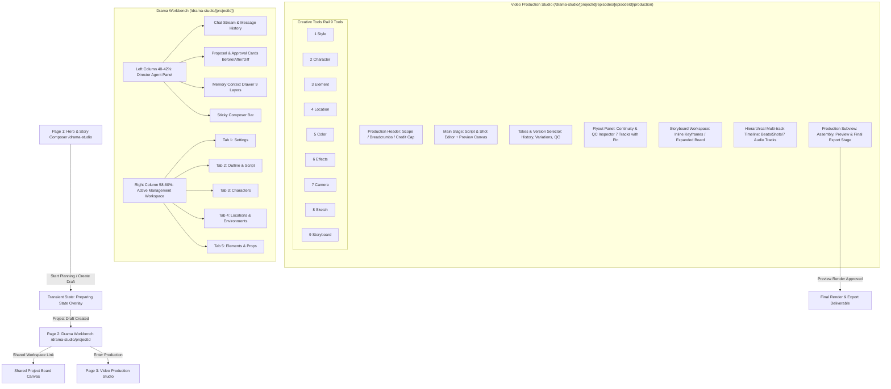

# Drama Studio — Phase 1.2 Design Audit & Architecture (Gate A)

**Role:** Lead Product Designer & UX Architect  
**Project:** Saad Studio — AI Microdrama & Film Production Platform  
**Stage:** Gate A — Audit, Information Architecture & Visual Direction (Corrected & Approved)  
**Status:** Gate A Completed & Awaiting Review | Gate B Blocked  

---

## 1. المصادر والوثائق المقروءة والقيود المستخرجة

### أ) قائمة المراجع والملفات المقروءة:
1. `docs/drama-studio/phase_1_architecture_v3.md` (الوثيقة المعمارية المعتمدة v3).
2. `docs/drama-studio/phase_1_1_spike_report.md` (تقرير الفحص التقني للريبو وسجلات النماذج والبيانات).
3. `docs/drama-studio/phase_1_1_repository_spike_plan.md` (خطة الفحص التقني).
4. `docs/drama-studio/phase_1_architecture_v2.md` & `phase_1_original.md`.
5. `app/(dash)/(routes)/drama-studio/page.tsx` (دراسة الـ Hero المعتمد وفصل الـ Prototype).
6. `tailwind.config.ts` & `app/globals.css` (سجل الـ Design Tokens المركزية: `--ss-bg`, `--ss-card`, `--ss-cyan`, `--ss-violet`).
7. `lib/video-model-registry.ts` & `lib/model-definition-registry.ts` (سجلات النماذج والقدرات الحقيقية).
8. `lib/use-language.ts` (نظام اللغات والتعامل مع RTL/LTR).
9. مرجع Topview AI (`topview.ai/drama-studio`) كـ Product Benchmark لفهم تدفق صناعة المسلسلات فقط بدون نسخ الهوية أو النصوص أو الأوامر أو الشخصيات.

### ب) القيود المستخرجة والملزمة (Hard Constraints):
* **Hero ومسار الدخول:** الـ Hero الحالي مقفول ومعتمد بالكامل (خلفية سينمائية، العنوان، Composer، معرض الأعمال، TopNavbar).
* **عدد المسارات (3 مسارات Drama جديدة فقط):**
  1. `/drama-studio` (Hero + Project Brief Entry).
  2. `/drama-studio/[projectId]` (Drama Workbench: المحادثة + التبويبات الإدارية الخمسة).
  3. `/drama-studio/[projectId]/episodes/[episodeId]/production` (Video Production Studio: غرفة التوليد والتايم لاين والتجميع).
  4. `Project Board`: مساحة عمل مشتركة موجودة بالمنصة تُفتح بسياق `projectId` وليست صفحة Drama رابعة مستقلة.
* **توزيع الأعمدة الثابت:** اليسار للوكيل (40%–42%)، واليمين لمساحة العمل (58%–60%) ثابت في اللغتين (لا ينقلب التوزيع بالعربية، واتجاه النص والمحاذاة داخل المحتوى فقط يتغيران).
* **التايم لاين الزمني:** من اليسار إلى اليمين LTR دائماً في اللغتين.
* **التبويبات الإدارية الخمسة بالأسماء الحرفية الكاملة:**
  1. `Settings`
  2. `Outline & Script`
  3. `Characters`
  4. `Locations & Environments`
  5. `Elements & Props`
* **الأدوات الإبداعية التسع داخل سكة الأدوات (Creative Tools Rail):**
  1. `Style`
  2. `Character`
  3. `Element`
  4. `Location`
  5. `Color`
  6. `Effects`
  7. `Camera`
  8. `Sketch`
  9. `Storyboard`
* **الـ Storyboard اختيارية:** 3 أوضاع (No Storyboard, Keyframes Only, Full Storyboard).
* **أوضاع المعالجة السردية:** (Faithful, Balanced, Creative) مستقلة تماماً عن صيغ البرومبت (Natural Description, Professional Storyboard, Faithful to Script).
* **الوكيل ليس Chatbot عادي:** محادثة حقيقية بذاكرة 9 طبقات، خيارات ومقترحات (Before/After/Scope/Continuity/Duration/Cost)، ولا رسائل Chat تلقائية عند كل نقرة إعدادات.
* **الهرمية الزمنية للإنتاج:** (`Project → Season → Episode → Scene → Beat → Shot → Generation Block → Take`).
* **المدد الزمنية الخمس المفصولة بصرياً:**
  1. `Target Duration`
  2. `Planned Duration`
  3. `Generated Duration`
  4. `Approved Duration`
  5. `Final Duration`
  (والمصطلح `Assembled Duration` تم توحيده إلى `Final Duration`، بينما التجميع `Assembly` هو مرحلة تقدم وحالة إنتاج).
* **المسارات الصوتية السبعة:** (Dialogue, Voice Over, Character Voice ID, Ambient, SFX, Music, Captions).
* **التسعير والاعتماد:** لا توليد ولا خصم بدون Quote مسبق واعتماد المستخدم، مع دعم حالات الحظر عند عدم توافق قدرات النماذج (Invalid Selector Cascade).

---

## 2. مقارنة دقيقة بين الـ Prototype الحالي والمنتج الحقيقي المطلوب

| المحور | Prototype الحالي (`page.tsx`) | المنتج الاحترافي المطلوب (Architecture v3) | فجوة التصميم المطلوب معالجتها في Gate B |
| :--- | :--- | :--- | :--- |
| **هيكل الصفحات والمسارات** | صفحة واحدة تعرض كل شيء بتبديل Local State تجريبي | 3 مسارات حقيقية مع مساحة انتقال سياقي (`[projectId]`) | تصميم شاشات Workbench و Production كشاشات احترافية مستقلة بروابط حقيقية |
| **لوحة الوكيل (Agent Panel)** | محادثة بسيطة بدون سياق ذاكرة أو بطاقات قرارات | وكيل مخرج متصل بذاكرة 9 طبقات، يقدم بطاقات قرارات (Proposed Change) واضحة | تصميم بطاقات المقترحات (Diff, Scope, Continuity, Cost) ومؤشر الذاكرة المدمج |
| **إدارة المشروع (Workbench Tabs)** | بطاقات عرض ثابتة ومكررة بدون تحرير حقيقي | 5 تبويبات إدارية تدعم التحرير، الحالة، وراثة النطاق (Scope & Pinning) بالأسماء الكاملة | تصميم واجهات الإدارة الخمس مع تمييز الحالات (Draft, Approved, Empty) بالأسماء المعتمدة |
| **استوديو الإنتاج (Production Studio)** | حقل برومبت مشهدي بسيط تحت المشاهد | غرفة إنتاج سينمائية احترافية: محرر لقطات، مفتش استمرارية، سكة 9 أدوات إبداعية | تصميم بيئة إنتاج متكاملة تعزل اللقطة الحالية وتربطها بالأصول ومسارات التجميع |
| **التايم لاين (Timeline)** | شريط لقطات أفقي بسيط من مستوى واحد | تايم لاين هرمي احترافي (Episode/Scene/Beat/Shot/Block/Take) مع 7 مسارات صوت | تصميم تايم لاين متعدد المسارات يدعم التكبير، السحب، والحالات المختلفة |
| **الـ Storyboard** | غير موجودة كأداة مستقلة | الأداة التاسعة اختيارية بـ 3 أوضاع و 8 وظائف حقيقية (مدمجة أو موسعة) | تصميم بيئة تحرير ومطابقة الستوريبورد مع الفيديو بدون إجبار |
| **المدد والتسعير** | مدة واحدة ورقم تقريبي | 5 مدد زمنية مفصولة + نظام Quote تفصيلي منسق مع الرصيد وسقف المشروع | تصميم بطاقة تسعير حية توضح تكلفة الفيديو والصوت والستوريبورد |
| **المسارات الصوتية** | غير ممثلة كمسارات مستقلة | 7 مسارات صوتية واضحة ومقاسة التوقيت | تصميم واجهة للمسارات السبعة وربط بصمة الصوت بالشخصيات |

---

## 3. Information Architecture (معمارية المعلومات)

---

## 4. Screen & Component Inventory (حصر الشاشات والمكونات)

### 1. المساحات والمسارات الأساسية (Core Spaces & Routes - 3 مسارات فقط + لوحة مشتركة):
* **SCR-01: Entry Hero & Story Composer (`/drama-studio`)** [مقفول ومعتمد].
* **SCR-02: Drama Workbench (`/drama-studio/[projectId]`)** (إطار العمل الثابت 40-42% يسار / 58-60% يمين).
  * **SCR-02A**: `Settings` View (Creative Positioning, Formats, Language, Ratios).
  * **SCR-02B**: `Outline & Script` View (Episode Cards, Scene & Beat hierarchy, Synopsis).
  * **SCR-02C**: `Characters` View (Visual cards, voice assignments, appearance state).
  * **SCR-02D**: `Locations & Environments` View (Time, lighting, weather, spatial layout).
  * **SCR-02E**: `Elements & Props` View (Recurring objects, weapon/vehicle tracking).
* **SCR-03: Video Production Studio (`/drama-studio/[projectId]/episodes/[episodeId]/production`)** (غرفة الإنتاج والتجميع الكاملة).
* **SCR-04: Shared Project Board (`/canvas` أو `/cinema-board` بسياق `projectId`)** [مساحة مشتركة موجودة بالمنصة وليست صفحة Drama رابعة].

### 2. الحالات الانتقالية والمراحل الداخلية (Transient States & Subviews):
* **STA-01: Preparing State Overlay** [Design Decision — Approved as a transient state, not a standalone screen or route].
* **SUB-01: Assembly, Preview & Final Export Stage** [Design Decision — Approved as an internal Production stage/subview, not a standalone route].

### 3. القضبان واللوحات المدمجة (Rails & Panels):
* **PNL-01: Director Agent Chat Stream** (محادثة الوكيل، التفكير، وتثبيت الردود).
* **PNL-02: Context & Memory Drawer** (مفتش الذاكرة المكون من 9 طبقات).
* **PNL-03: Creative Tools Rail (9 Tools)** (سكة الأدوات الإبداعية مع Scope, Pin, Inheritance).
* **PNL-04: Continuity & QC Inspector (Flyout with Pin)** (مفتش الاستمرارية للأبعاد السبعة يفتح تلقائياً عند التحذير).
* **PNL-05: Storyboard Workspace** (شريط Keyframes مدمج أو مساحة موسعة داخل صفحة Production).
* **PNL-06: Hierarchical Multi-track Timeline** (التايم لاين الزمني الهرمي مع مسارات الصوت السبعة LTR).

### 4. النوافذ المنبثقة وبطاقات القرارات (Modals & Action Cards):
* **MDL-01: Proposal Decision Card** (بطاقة مقارنة التعديل Before / After مع التأثير والكلفة).
* **MDL-02: Prompt Format Switch Modal** (تغيير صيغة البرومبت وتحديد نطاق إعادة التوليد).
* **MDL-03: Dynamic Quote & Credit Reservation Breakdown** (عرض تفاصيل التكلفة وسقف الرصيد).
* **MDL-04: Invalid Selector Cascade Resolver** (حل تعارضات النماذج والأبعاد والمدد).
* **MDL-05: Take & Version Comparison Modal** (مقارنة النسخ والمحاولات جنب إلى جنب).

---

## 5. الاتجاه البصري المعتمد لـ Saad Studio

### 🏆 الاتجاه البصري المعتمد: "Cinematic Director Workspace"

**المرجعية البصرية ونظام الـ Tokens المركزي:**
* **الأساس:** الـ Design Tokens الرسمية لـ Saad Studio (`--ss-bg`, `--ss-card`, `--ss-cyan`, `--ss-violet`).
* **خلفية مساحة العمل:** كحلي داكن عميق (`--ss-bg`) يضمن الانتقال الانسيابي المشترك من الـ Hero إلى الـ Workbench.
* **البطاقات والأسطح:** أسطح داكنة كحلية متبلورة ناعمة (`--ss-card`) بدون زجاجية مفرطة أو حدود زرقاء متكلفة.
* **ألوان التمييز والتفاعل:**
  * **Cyan (`--ss-cyan`):** للإجراءات الأساسية، التركيز، وحالات التحديد النشطة.
  * **Violet (`--ss-violet`):** لحالات الذكاء الاصطناعي، الوكيل، ومؤشرات التوليد.
  * **Amber / Orange:** مخصص **حصرياً** لحالات التحذير والاستمرارية الدلالية (Continuity Warnings) ولا يُستخدم كلون رئيسي عام.
* **فلسفة التصميم والكثافة:**
  * يدمج بين **هوية Saad Studio الفعلية** (Cyan + Violet + Navy) و**كثافة المعلومات السينمائية الوظيفية** المناسبة لإنتاج الأفلام والمسلسلات.
  * تدرج بصري واضح وهرمي بين المعلومات الأساسية والثانوية دون نصوص صغيرة غير مقروءة أو مساحات مهدورة.
  * أداة إخراج ومونتاج احترافية متصلة ومريحة للعمل الطويل، بعيدة تماماً عن الـ Dashboard التقليدية وعن الرماديات الباهتة لـ Topview.

---

## 6. قرارات التصميم المعتمدة (Owner Design Decisions — Approved)

| القرار | القيمة المعتمدة | المبرر والسلوك الملزم |
| :--- | :--- | :--- |
| **Visual Authority** | Saad Studio Canonical Tokens (`--ss-bg`, `--ss-card`, `--ss-cyan`, `--ss-violet`) | الاعتماد الصارم على نظام الـ Tokens المركزي للمنصة؛ لا ألوان Hex مخترعة ولا ادعاء تطابق دون قياس. |
| **Hero Scope** | Locked & Preserved | الـ Hero الحالي مقفول ومعتمد بخلفيته وعنوانه والـ Composer؛ الانتقال إلى الـ Workbench عبر الخلفية الكحلية المشتركة. |
| **Visual Direction** | `Cinematic Director Workspace` | اتجاه يجمع هوية Saad Studio (Cyan/Violet/Navy) مع الكثافة والوضوح السينمائي الاحترافي للإنتاج الطويل. |
| **Storyboard Integration** | Optional (No Board / Collapsible Keyframes / Expanded Workspace in Production) | أداة اختيارية بالكامل؛ لا تفرض كخطوة إلزامية، وتُعرض إما مدمجة أو موسعة داخل نفس صفحة الـ Production بدون Route إضافي. |
| **Continuity Inspector** | Flyout Drawer with Pin & Auto-open on warning | لوحة جانبية خفيفة تفتح تلقائياً عند وجود تحذير استمرارية ويمكن تثبيتها بـ Pin؛ تدعم الفئات السبعة وتتطلب موافقة للتصحيح. |
| **Responsive Scope** | Desktop-first (1280px / 1440px / 1920px) | التركيز على شاشات سطح المكتب في Gate B؛ توزيع الأعمدة 40-42% / 58-60% ثابت LTR في اللغتين؛ تأجيل Mobile كخيارات مستقلة. |
| **Preparing State** | Transient state only | حالة انتقالية مؤقتة لتحميل وتهيئة المشروع؛ ليست صفحة مستقلة وليست Route رابعاً. |
| **Assembly Stage** | Internal Production subview only | مرحلة ومسار فرعي داخل Video Production Studio يشمل التجميع، الميكساج، والرندر النهائي؛ ليس Route مستقلاً. |

---

## 7. الخطوات التالية وحالة البوابة

* **حالة Gate A:** مكتمل ومصحح بالكامل وموثق وفق قرارات المالك.
* **حالة Gate B (Wireframes & UX):** **متوقف (Blocked)** تماماً بانتظار مراجعة المالك واعتماد هذه الوثيقة.
* **التزام التنفيذ:** لم يتم تعديل أي كود برمجي، ولم يتم إنشاء أي Wireframes أو مكونات، والعمل متوقف تماماً هنا.
