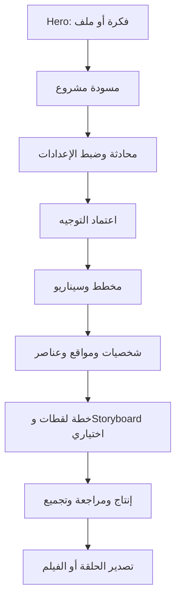
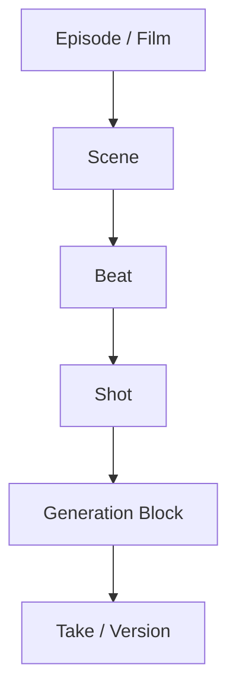

# المرجع التنفيذي الكامل والمعتمد لصفحة Drama Studio

**الإصدار:** 1.1  
**التاريخ:** 25 أغسطس 2026  
**الحالة:** مواصفات ودراسة قبل التنفيذ — لا يُسمح باعتبار النموذج الحالي مرجعاً برمجياً نهائياً  
**مرجع المنتج الأصلي:** [Topview AI — Drama Studio](https://www.topview.ai/drama-studio)  
**النطاق:** تجربة المستخدم، بنية الصفحات، الوكيل، ذاكرة المشروع، التخطيط السينمائي، أدوات الإبداع، الـStoryboard الاختياري، إنتاج فيديو طويل، الاستمرارية، الصوت، الكريدت، الأوديت، والقبول النهائي.

---

## 0. طريقة قراءة هذا المرجع ومنع التخمين

هذه الوثيقة هي **مصدر الحقيقة الوحيد** قبل استكمال البرمجة. كل بند يحمل تصنيفاً واضحاً:

- **[مرجع Topview]**: سلوك أو ترتيب ظاهر فعلياً في صفحة Topview الرسمية أو الصور والتسجيلات المأخوذة منها.
- **[قرار]**: توجيه صريح من صاحب المشروع ويجب تنفيذه حرفياً.
- **[هندسة لازمة]**: متطلب تقني لا يمكن أن يعمل المنتج الطويل بدونه.
- **[غير محسوم]**: معلومة لم تُثبت بعد، ويُمنع اختراع قرار بدلاً عنها.

### 0.1 موقع Topview في هذه الدراسة

- **[قرار]** فكرة Drama Studio وتدفق المنتج الأساسي مأخوذان من **Topview AI Drama Studio**؛ لذلك Topview هو **مرجع المنتج والـBenchmark الأساسي** لهذه الدراسة، وليس مجرد إلهام بصري أو مجموعة صور متفرقة.
- المطلوب هو دراسة التجربة الظاهرة في Topview وإعادة بناء **فئتها الوظيفية وتدفقها التشغيلي** داخل سعد ستوديو: مدخل الفكرة، إعداد المشروع، الوكيل، المخطط والسيناريو، الشخصيات، البيئات، الأدوات، غرفة إنتاج الفيديو، التايم لاين، صيغ البرومبت، مزامنة الأصول، ولوحة المشروع.
- لا يجوز الادعاء بأن فكرة هذا النوع من الصفحة أصلية لسعد ستوديو. الأصلي في سعد ستوديو هو **التنفيذ، الهوية، اللغة، الأصول، الكود، البنية الخلفية، التكاملات، وسياسات التشغيل**.
- المطابقة المقصودة هي **مطابقة وظيفية مدروسة** وليست نسخاً حرفياً للعلامة أو المحتوى: لا تُنسخ شيفرة Topview، شعاراته، صوره، قصته التجريبية، أسماء شخصياته، نصوصه، أو أصوله المحمية.
- أي سلوك ظاهر بوضوح في المرجع يوثق باسم **[مرجع Topview]**. وأي سلوك غير ظاهر أو غير قابل للتحقق يبقى **[غير محسوم]** ولا يُخترع.
- متطلبات صاحب المشروع الإضافية — ومنها ذاكرة المشروع الدائمة، هندسة إنتاج مدة تتجاوز حدود الموديل، Storyboard اختياري، ودعم العربية والإنجليزية — تُنفذ كامتدادات هندسية لسعد ستوديو مع الحفاظ على التدفق الأساسي للمرجع.

لا يجوز للإيجنت:

1. نسخ قصة أو شخصيات أو أوامر أو نصوص أو أسماء أو صور أو شيفرة من Topview حرفياً؛ ويُسمح بدراسة بنيته ووظائفه وتدفقه كمقياس المنتج الأساسي.
2. وصف واجهة تجريبية بأنها منتج مكتمل أو ديناميكي فعلياً.
3. تثبيت موديل أو سعر أو حد زمني داخل الصفحة قبل قراءته من سجل المنصة المركزي.
4. اعتبار `useState` ذاكرة مشروع أو اعتبار زر `[+]` محرك إنتاج فيديو طويل.
5. إضافة Hook أو Cliffhanger أو قالب سردي إلزامي لكل فيلم أو مسلسل.
6. تنفيذ أي بند مصنف **[غير محسوم]** قبل سؤال صاحب المشروع أو تدقيق المستودع.

---

## 1. القرار المختصر: كم صفحة، وكم تبويب، وكم أداة؟

### 1.1 الصفحات ومساحات العمل

| العدد | النوع | المسار المقترح | الوظيفة | القرار |
|---:|---|---|---|---|
| 1 | صفحة جديدة | `/drama-studio` | الـHero، إدخال الفكرة/الملف، الاختيارات الأولية، الأعمال المختارة، والمشاريع الحديثة لاحقاً | الـHero الحالي المعتمد يُحافظ عليه |
| 2 | صفحة جديدة | `/drama-studio/[projectId]` | مساحة العمل الرئيسية: الوكيل في اليسار، المراحل والتبويبات والأدوات في اليمين | مطلوبة |
| 3 | صفحة جديدة | `/drama-studio/[projectId]/episodes/[episodeId]/production` | غرفة إنتاج الحلقة: النص/البرومبت، المعاينة، النسخ، التايم لاين، التوليد والتجميع | مطلوبة |
| 4 | مساحة موجودة يعاد استخدامها | المسار الفعلي للـProject Board في المنصة | لوحة الأصول البصرية للمشروع | لا تُبنى نسخة مزيفة؛ المسار يُحدد بعد تدقيق المستودع |

**الحصيلة الدقيقة:**

- **3 صفحات/Routes جديدة.**
- **1 مساحة موجودة يعاد ربطها، وليست صفحة جديدة.**
- **4 مساحات ظاهرة للمستخدم بالمجموع.**
- شاشة التجهيز/التحميل إن استُخدمت فهي **حالة انتقالية داخل الصفحة** وليست Route مستقلاً.
- الـStoryboard **أداة ومساحة اختيارية داخل المشروع والإنتاج**، وليس Route إجبارياً مستقلاً.

### 1.2 تبويبات الإدارة في Workbench

عددها **5 تبويبات فقط** وبالترتيب المكاني الثابت من اليسار إلى اليمين:

1. `Settings` — الإعدادات والنمط.
2. `Outline & Script` — المخطط والسيناريو.
3. `Characters` — الشخصيات.
4. `Locations & Environments` — المواقع والبيئات.
5. `Elements & Props` — العناصر والأدوات.

`Open Project Board` و`Enter Video Production` **أزرار انتقال وليسا تبويبين**.  
`Hook Chain` **غير موجود كمتطلب إلزامي** ولا يُنسخ من المرجع.

### 1.3 أدوات الإبداع داخل الصفحة

عددها **9 أدوات بالضبط** وفق المرجع الذي حدده صاحب المشروع:

1. Style
2. Character
3. Element
4. Location
5. Color
6. Effects
7. Camera
8. Sketch
9. Storyboard — **اختياري**

الصوت ليس أداة عاشرة في هذا الشريط. يُدار عبر بصمة صوت الشخصية ومسارات الصوت داخل غرفة الإنتاج، ما لم يصدر قرار لاحق بإضافة أداة مستقلة.

---

## 2. ما هو معتمد وما هو مرفوض من التنفيذ الحالي؟

### 2.1 المعتمد

- **[قرار]** الـHero السينمائي الذي تمت الموافقة عليه يبقى كما هو من حيث البنية العامة: خلفية سعد ستوديو، العنوان، الـComposer، اختيار الموديل/النمط/الكاتب، زر الإرسال، ومعرض الأعمال.
- **[قرار]** عنصر Drama Studio في الـTopNavbar وقائمة الفيديو يمكن الإبقاء عليه بعد تدقيق عدم تكراره.
- **[قرار]** هوية سعد ستوديو وأصولها فقط.

### 2.2 المرفوض كمصدر للتنفيذ

- الـWorkbench الحالي المصنوع ببطاقات عشوائية أو بيانات ثابتة ليس مرجعاً.
- النصوص التي نُسخت من قصة المرجع أو أسماء شخصياته أو تعليماته ليست مقبولة.
- الرسائل الكبيرة التي تشبه تقارير وليست محادثة ليست وكيلاً.
- عبارة “Language changed to Arabic” ورسائل كل نقرة داخل الدردشة مرفوضة.
- عرض خطأ أحمر عام `1 error` من دون تفسير ومعالجة مرفوض في تسليم المنتج.
- ادعاء أن كل شيء “يعمل 100%” بينما لا توجد قاعدة بيانات أو Jobs أو Ledger أو APIs مرفوض.

---

## 3. الهدف الحقيقي للمنتج

Drama Studio ليس مولد مقطع واحد مدته 30 ثانية. هو **نظام تخطيط وإنتاج وتجميع عمل سردي طويل** يمكن أن يكون:

- حلقة قصيرة.
- ميكرودراما متعددة الحلقات.
- مسلسل.
- فيلم قصير أو أطول.
- عمل وثائقي أو تعليمي عند اختيار ذلك.

الموديل ينتج **وحدة توليد قصيرة**؛ أما الحلقة أو الفيلم فينتج من تخطيط عدة وحدات، المحافظة على الذاكرة والاستمرارية، مراجعة النسخ، ثم المونتاج والتصدير النهائي.

---

## 4. التدفق العام الصحيح

### 4.1 حالات المشروع

1. `Draft` — تم إدخال الفكرة ولم تُعتمد الإعدادات.
2. `Configuring` — المستخدم يحاور الوكيل ويضبط التوجيه.
3. `Planning` — الوكيل يبني مخططاً منظماً.
4. `Asset Preparation` — اعتماد الشخصيات والمواقع والعناصر والمراجع.
5. `Script & Shot Planning` — تثبيت السيناريو واللقطات ووحدات التوليد.
6. `Production` — توليد الـTakes ومراجعتها.
7. `Assembly` — مونتاج الصورة والصوت والترجمة.
8. `Review` — مراجعة الحلقة كاملة.
9. `Completed` — نسخة نهائية قابلة للتصدير.

لا يجوز القفز من الفكرة مباشرة إلى فيديو طويل من دون حالات التخطيط والاعتماد.

---

## 5. الصفحة الأولى: Hero وStory Composer

### 5.1 ما يظهر

- خلفية سينمائية بهوية سعد ستوديو.
- عنوان واضح لإنتاج المسلسل أو الفيلم بالذكاء الاصطناعي.
- مساحة كبيرة لكتابة الفكرة أو لصق النص.
- رفع سيناريو/رواية/مستند من الأنواع التي يدعمها Backend فعلياً.
- اختيار مبدئي لنمط المشروع: حلقة مفردة أو مسلسل.
- اختيار موديل مبدئي من **الموديلات النشطة فقط** في السجل المركزي.
- اختيار مستوى مساعدة الكاتب إن كان هذا النظام موجوداً فعلياً في المنصة.
- زر بدء واحد واضح.
- معرض أعمال سعد ستوديو، لا صور المرجع.

### 5.2 ما يحدث عند الإرسال

1. التحقق من وجود فكرة أو ملف صالح.
2. إنشاء **مسودة مشروع حقيقية** بمعرف `projectId`.
3. حفظ نص المستخدم والملف والأصول، لا الاحتفاظ بها في المتصفح فقط.
4. الانتقال إلى Workbench.
5. لا يبدأ توليد الفيديو ولا خصم كريدت فيديو في هذه الخطوة.
6. يمكن تنفيذ تحليل أولي قصير، لكن لا يُعرض كأنه مخطط معتمد.

### 5.3 شاشة التجهيز الانتقالية

إن استُخدمت، يجب أن تعرض عمليات حقيقية مثل رفع الملف، استخراج النص، وإنشاء المسودة. لا يجوز وضع Progress مزيف أو تأخير مصطنع. يمكن تخطي الرسوم المتحركة، لكن لا يمكن تخطي العمليات اللازمة.

---

## 6. الصفحة الثانية: Workbench

### 6.1 التوزيع المكاني الثابت

- **اليسار دائماً:** الوكيل/المحادثة، بعرض تقريبي 40–42% على Desktop.
- **اليمين دائماً:** المرحلة النشطة، بعرض تقريبي 58–60%.
- لا ينعكس العمودان عند التحويل إلى العربية.
- العربية تغيّر اتجاه النص ومحاذاته داخل المحتوى فقط.
- لكل عمود تمرير مستقل.
- Composer الوكيل مثبت أسفل العمود الأيسر.
- شريط التبويبات وترتيب التايم لاين يبقيان LTR مكانياً في اللغتين.

### 6.2 الحالة الأولى بعد الدخول

**[مرجع + قرار]**

- يظهر كلام المستخدم كرسالة في المحادثة اليسرى.
- يرد الوكيل برسالة قصيرة تلخص ما فهمه، ويسأل سؤالاً واحداً فقط إذا كان هناك غموض مؤثر.
- يعرض داخل المحادثة بطاقة إعداد مدمجة وصغيرة، لا لوحة تقارير كبيرة.
- يكون `Outline & Script` هو التبويب الظاهر، لكنه يعرض Empty State قبل اعتماد الإعدادات.
- يمكن للمستخدم فتح `Settings` لضبط التفاصيل.
- زر `Confirm & Start Planning` يعتمد التوجيه ويبدأ Job التخطيط.

### 6.3 شريط Workbench العلوي

- رجوع إلى Drama Studio.
- اسم المشروع القابل للتعديل.
- التبويبات الخمسة بالترتيب الثابت.
- زر فتح Project Board.
- مؤشر حالة التحضير المبني على بيانات فعلية.
- زر دخول الإنتاج يظهر أو يتفعّل فقط عندما تستوفي الحلقة متطلبات الإنتاج.

---

## 7. الوكيل: مكانه، محادثته، وطريقة عمله

### 7.1 هوية واجهة الوكيل

- وكيل واحد ظاهر للمستخدم، مثل “مخرج سعد ستوديو”.
- ترويسة صغيرة مع حالة الاتصال/العمل.
- منطقة رسائل قابلة للتمرير.
- فقاعات مستخدم ووكيل مميزة.
- خيارات سريعة داخل رسالة الوكيل عند الحاجة.
- إرفاق ملفات.
- Composer واسع وثابت في الأسفل.
- `Enter` للإرسال و`Shift+Enter` لسطر جديد.
- حالة كتابة أو تنفيذ واضحة، مع زر إيقاف عند وجود Job قابل للإيقاف.

### 7.2 ما يستطيع المستخدم طلبه

- تعديل فكرة أو مشهد أو حوار.
- تحليل مشكلة سردية.
- طلب بدائل متعددة.
- تعديل شخصية أو موقع أو عنصر.
- طلب تقسيم مشهد إلى لقطات.
- طلب تقليل/زيادة الزمن مع إظهار أثر ذلك.
- مراجعة الاستمرارية.
- طلب Storyboard للمشهد أو اللقطات المحددة.
- طلب توليد/إعادة توليد وحدة بعينها بعد عرض التكلفة.

### 7.3 قاعدة التفاعل

1. الوكيل يقرأ **ذاكرة المشروع المعتمدة** قبل الرد.
2. الرد الحر لا يغير المشروع تلقائياً.
3. عند اقتراح تعديل، ينتج الوكيل `Proposal` منظماً يوضح:
   - ما الذي سيتغير.
   - النطاق المتأثر.
   - التعارضات المحتملة.
   - الزمن والكلفة المتوقعة إن كان للتعديل أثر إنتاجي.
4. لا تتحول المقترحات إلى مصدر حقيقة إلا بعد `Apply/Approve`.
5. التغييرات البسيطة في Settings تُحدّث سياق المشروع بصمت، ولا تُرسل رسالة دردشة لكل نقرة.
6. إذا غيّر المستخدم معلومة قديمة، يسأله الوكيل عن نطاق التغيير قبل نشره على الحلقات واللقطات.

### 7.4 ما يُمنع داخل المحادثة

- رسائل نظام غير مفيدة مثل تغيير اللغة أو فتح قائمة.
- تكرار نفس الرد.
- نسخ أوامر المرجع.
- تقرير طويل مكان المحادثة من دون طلب.
- تغيير المحتوى من دون موافقة.
- ادعاء توليد أو حفظ لم يحدث فعلياً.

---

## 8. ذاكرة الوكيل واستمرارية القصة

### 8.1 الذاكرة ليست Chat History فقط

**[قرار + هندسة لازمة]** الذاكرة دائمة ومرتبطة بـ`projectId`، وتتكوّن من:

1. **Project Bible:** العالم، القواعد، النبرة، الحدود، المصطلحات.
2. **Character Memory:** الهوية، المظهر، الصوت، المعرفة، العلاقات، الحالة النفسية والجسدية.
3. **Narrative Timeline:** ترتيب أحداث القصة الحقيقي منفصلاً عن ترتيب عرضها، لدعم الفلاش باك والتوازي.
4. **Episode/Scene Memory:** هدف كل حلقة ومشهد ونتيجته.
5. **Continuity Snapshots:** حالة الدخول والخروج لكل لقطة ووحدة توليد.
6. **Approved Decisions:** القرارات المعتمدة ومن اعتمدها ووقتها.
7. **Version Memory:** المسودة، النسخة المعتمدة، النسخ القديمة والمرفوضة.

### 8.2 حزمة السياق لكل توليد

قبل توليد أي لقطة يجب تكوين `Generation Context Packet` يحتوي على الأقل على:

- ملخص المشروع.
- موقع اللقطة في الخط الزمني السردي وفي ترتيب العرض.
- هدف المشهد واللقطة.
- ما حدث قبلها وما يجب أن يحدث بعدها.
- الشخصيات المشاركة وحالتها ومظهرها الحالي.
- الموقع والوقت والطقس والإضاءة.
- العناصر وحالتها ومالكها ومكانها.
- `continuityIn` و`continuityOut`.
- الحوار/الصوت وتوقيته.
- الكاميرا واللون والمؤثرات.
- مراجع Style/Character/Element/Location/Sketch/Storyboard المختارة.
- المحظورات، مثل عدم تغيير الملابس أو الاتجاه أو هوية الوجه.

لا يُرسل تاريخ المشروع كله إلى الموديل؛ يسترجع النظام الجزء المرتبط باللقطة ويثبّت القرارات المعتمدة.

---

## 9. السرد: لا Hook إلزامي ولا قالب واحد

### 9.1 القرار

- الفيلم أو المسلسل لا يُعامل كفيديو Hook.
- لا يوجد `Hook Chain` إلزامي.
- لا يوجد Cliffhanger إلزامي.
- لا توجد بنية فصول ثابتة مفروضة على كل نوع.

### 9.2 أوضاع التعامل مع النص

1. **Faithful Adaptation — التزام بالنص:** الحفاظ على بنية النص وحواره، وتقتصر التغييرات على تحويله إلى خطة إنتاج.
2. **Balanced Adaptation — تكييف متوازن:** السماح بتعديلات إيقاعية محدودة بعد عرضها للمستخدم.
3. **Creative Adaptation — تكييف إبداعي:** السماح بإعادة بناء أوسع بعد اعتماد المستخدم.

### 9.3 الجذب الافتتاحي

يمكن للوكيل اقتراح تحسين افتتاحية فقط عندما يناسب نوع العمل والمنصة المستهدفة، ويكون اقتراحاً اختيارياً لا قاعدة مفروضة.

---

## 10. تبويب Settings

### 10.1 Art Style

- Live Action.
- Animation.
- Custom.
- الأنماط والصور تأتي من مكتبة سعد ستوديو أو Registry معتمد، لا من المرجع.
- عدد Presets غير مثبت في هذه الوثيقة؛ يُعرض المتاح فعلياً في المنصة.
- Custom يسمح بوصف النمط وإضافة مراجع.

### 10.2 Basic Project Settings

- نوع المشروع: حلقة مفردة / مسلسل.
- نسبة العرض: وفق ما تدعمه مسارات النماذج والمنتج.
- **المدة النهائية المستهدفة للحلقة**: Auto أو Manual.
- لغة محتوى الفيديو منفصلة عن لغة الواجهة.
- التصنيف العمري/سلامة المحتوى.
- وضع التكييف السردي الثلاثي.
- مراجعة وتحسين آلي، مع شرح أنه يزيد الوقت والكلفة.

### 10.3 Creative Positioning

- Genre.
- Background/World.
- Tone/Trope عند الحاجة.
- لا تُنسخ قوائم المرجع حرفياً.
- يمكن اختيار قيمة من بيانات سعد ستوديو أو إدخال Custom.

### 10.4 اعتماد الإعدادات

قبل التأكيد، يعرض النظام ملخصاً مضغوطاً. بعد التأكيد:

- تُحفظ نسخة إعدادات معتمدة.
- يبدأ Job التخطيط.
- يُسجل القرار في ذاكرة المشروع.
- إذا غُيّرت إعدادات جوهرية لاحقاً، يعرض النظام نطاق إعادة التخطيط ولا يهدم العمل بصمت.

---

## 11. تبويب Outline & Script

### 11.1 قبل التخطيط

- Empty State واضح: لا يوجد مخطط بعد.
- زر تأكيد الإعدادات والبدء.
- خيار إنشاء حلقة يدوياً.
- لا تُعرض بيانات وهمية.

### 11.2 بعد التخطيط

- **Project Overview** بهوية سعد ستوديو:
  - الجملة التعريفية للمشروع.
  - السؤال أو المحرك الدرامي المركزي، إن كان مناسباً.
  - عدد الحلقات.
  - المدة المستهدفة والمخططة.
  - عدد الشخصيات والمواقع والعناصر.
- بطاقات الحلقات وتشمل:
  - رقم وعنوان الحلقة.
  - ملخصاً.
  - المدة المستهدفة والمخططة.
  - عدد المشاهد واللقطات ووحدات التوليد.
  - حالة السيناريو وحالة الإنتاج.
  - View/Edit Script.
  - Enter Video Production عند الجاهزية.
- إضافة حلقة وتحديد موضعها.
- AI Optimize مع Diff وموافقة، لا تعديل صامت.
- Export Script & Assets.
- Scene List.

لا يوجد زر Hook Chain إلزامي.

---

## 12. تبويبات الأصول

### 12.1 Characters

بطاقة تشغيلية كبيرة لكل شخصية:

- الاسم والدور.
- مراجع وصورة معتمدة.
- Appearance وملامح ثابتة.
- Character Looks متعددة حسب الزمن/المشهد.
- الملابس والإصابات والأدوات المرتبطة.
- السمات والعلاقات.
- بصمة الصوت المرجعية.
- Generate / Upload / Import from Board.
- حالة الاعتماد والنسخة النشطة.
- تكلفة حقيقية من Registry قبل التوليد.

### 12.2 Locations & Environments

- اسم الموقع ووظيفته السردية.
- وصف بصري وبنية المكان.
- الوقت والطقس والإضاءة.
- مراجع متعددة.
- تخطيط مكاني يساعد اتجاه الحركة والكاميرا.
- Generate / Upload / Import.
- نسخة معتمدة وحالة جاهزية.

### 12.3 Elements & Props

- اسم العنصر ونوعه.
- وصفه وشكله ومادته.
- المالك والحالة والموقع عبر الزمن.
- مراجع وصور ونسخ.
- ارتباطه بالمشاهد واللقطات.
- Generate / Upload / Import.

التبويبات وأدوات الشريط الإبداعي تستخدم **نفس السجلات**؛ لا توجد نسخ بيانات منفصلة.

---

## 13. الأدوات الإبداعية التسع داخل Workbench

تظهر كـRail ضيق داخل الجهة اليمنى، ولا تستبدل الوكيل الموجود في اليسار. لكل أداة Scope: مشروع، حلقة، مشهد، مجموعة لقطات، أو اللقطة الحالية. التثبيت Pin يعني تثبيت الأداة ونطاقها في حزمة التوليد.

| # | الأداة | ما تتحكم به | ما تحفظه في المشروع | أثرها في التوليد |
|---:|---|---|---|---|
| 1 | Style | النوع البصري، الخامة، الواقعية، المرجع الجمالي، Negative style | Style Profile ونسخه ونطاقه | يضاف إلى Context Packet حسب النطاق |
| 2 | Character | هوية الشخصية، المظهر، Look، الملابس، الصوت والحالة | Character + Look + State | تثبيت الهوية والمظهر والصوت |
| 3 | Element | الأدوات، المركبات، الرموز والأشياء | Element/Prop + State + Ownership | منع تغير العنصر أو اختفائه |
| 4 | Location | المكان، الوقت، الطقس، الإضاءة والتخطيط | Location Profile + Scene binding | ثبات البيئة والاتجاه المكاني |
| 5 | Color | Palette، الحرارة، التباين والتعريض | Color Profile | توحيد اللون بين الوحدات |
| 6 | Effects | المؤثرات العملية والبصرية وتوقيتها | Effect Spec + Timing | إدخال تعليمات VFX المرتبطة باللقطة |
| 7 | Camera | حجم اللقطة، العدسة، الزاوية، الحركة، محور الشاشة | Camera Spec | ضبط التكوين والحركة والاستمرارية |
| 8 | Sketch | رسم أو Blocking أو Composition guide أو Annotation | Sketch Asset + bindings | مرجع تكوين اختياري للموديل/الفريق |
| 9 | Storyboard | لوحات بصرية وربطها باللقطات والإطارات | Storyboard Frames اختيارية | مرجع بصري اختياري، لا يمنع الإنتاج عند غيابه |

---

## 14. الـStoryboard الاختياري

### 14.1 القرار الصريح

- Storyboard **موجود** ولا يجوز تجاهله.
- Storyboard **اختياري** ولا يجوز جعله شرطاً لإكمال المشروع.
- Shot Planning والاستمرارية إلزاميان للفيديو الطويل؛ الصور المرسومة للـStoryboard ليست إلزامية.

### 14.2 الأوضاع الثلاثة

1. **No Storyboard:** خطة لقطات نصية وكاميرا واستمرارية فقط.
2. **Keyframes Only:** لوحة أو إطارات رئيسية للمشاهد/اللقطات الحرجة فقط.
3. **Full Storyboard:** لوحات كاملة لكل لقطة أو لكل وحدة وفق اختيار المستخدم.

يمكن اختيار الوضع على مستوى المشروع أو الحلقة أو المشهد، مع Override للقطات محددة.

### 14.3 وظائف الأداة

- توليد لوحة من Shot Plan.
- رفع لوحة أو Sketch.
- Import from Project Board.
- ربط لوحة بلقطة أو Generation Block.
- تحديد First Frame وLast Frame عندما يدعم الموديل ذلك.
- اعتماد/رفض/إعادة توليد لوحة.
- عرض مقارنة مع الفيديو الناتج.
- عدم إظهار تحذير “المشروع ناقص” عند اختيار No Storyboard.

---

## 15. هندسة الفيديو الطويل: من 30 ثانية إلى 5 دقائق أو أكثر

### 15.1 الهرمية الصحيحة

- **Scene:** وحدة مكان/زمن/حدث، وقد تكون أطول كثيراً من حد الموديل.
- **Beat:** تغير درامي أو حركي داخل المشهد.
- **Shot:** لقطة مونتاجية محددة بكاميرا وزمن.
- **Generation Block:** الطلب الفعلي المرسل إلى موديل الفيديو، ولا يتجاوز قدراته.
- **Take:** نتيجة أو محاولة من نفس الوحدة، وتُختار منها نسخة معتمدة.

### 15.2 الحساب الصحيح للمدة

إذا كان الزمن النهائي المطلوب `T`، والحد الأعلى للموديل `Dmax`:

\[
N_{minimum}=\left\lceil\frac{T}{D_{max}}\right\rceil
\]

مثال مؤكد حسابياً فقط:

- 5 دقائق = 300 ثانية.
- إذا كان الحد الأعلى 30 ثانية، فالحد الرياضي الأدنى = 10 وحدات.
- **هذا ليس خطة إنتاج.** العدد الفعلي لا يُقرر قبل تقسيم المشاهد واللقطات؛ غالباً يحتاج المونتاج وحدات أقصر لأن تغيير الزاوية والإيقاع والاستمرارية أهم من استهلاك 30 ثانية كاملة في كل مرة.

لا توضع قيمة عشوائية مثل “21 وحدة” أو “54 لقطة” كقاعدة. ينتجها Scheduler من السيناريو والمدة وأسلوب الإخراج.

### 15.3 استراتيجيات تكوين العمل الطويل

1. **Cut-based Blocks:** توليد وحدات مستقلة وتجميعها بالمونتاج؛ الأكثر تحكماً واعتمادية.
2. **Last-frame Chaining:** استخدام نهاية الوحدة مرجعاً لبداية التالية عندما تكون الحركة المستمرة مطلوبة والموديل يدعمها.
3. **Native Extension:** تمديد فيديو سابق عندما يدعم المزود ذلك، مع احترام قيوده.
4. **Hybrid:** الجمع بين القطع والربط والتمديد حسب المشهد؛ هو الأسلوب التشغيلي الصحيح، لا استخدام استراتيجية واحدة لكل الحلقة.

### 15.4 حقائق قدرات النماذج التي يجب ألا تُفترض داخل UI

- توثيق BytePlus الحالي يذكر أن Seedance 2.5 ينتج 4–30 ثانية بدقتي 480p/720p، ويدعم مدخلات ومراجع متعددة، والإطار الأول/الأخير، والتمديد والصوت بحسب مسار المزود. يجب مع ذلك قراءة القدرات من Registry الفعلي للمنصة عند التشغيل.
- توثيق Google الحالي يذكر أن Veo 3.1 يولد فيديو 8 ثوانٍ، ويدعم 9:16/16:9، والإطار الأول/الأخير، والصوت، ومراجع الصور. تمديد Veo يضيف 7 ثوانٍ حتى 20 مرة ويصل إلى 148 ثانية، ويشترط فيديو مولداً بـVeo. لذلك حتى التمديد لا يلغي الحاجة إلى التجميع للفيديو الأطول.
- لا يُعرض خيار لا يدعمه Route الفعلي للموديل.

### 15.5 ما يفعله Scheduler

1. يقرأ المدة المستهدفة والنص.
2. يقدر زمن الحوار والتعليق والصمت والحركة.
3. يقسم الحلقة إلى Scenes وBeats وShots.
4. يختار حدود Generation Blocks وفق قدرات الموديل.
5. يحدد استراتيجية كل انتقال: Cut / Last Frame / Extension.
6. يضيف Context Packet لكل Block.
7. يحسب عدد الـTakes المتوقع والكلفة.
8. يعرض الخطة للمستخدم قبل الخصم.

زر `[+]` في التايم لاين يضيف وحدة محددة النوع، ولا يعني وحده تمديد العمل. يجب أن يسأل: إضافة Scene أم Shot أم Generation Block أم مقطع مرفوع؟

---

## 16. الاستمرارية Continuity

### 16.1 ما يجب تتبعه

- **الشخصية:** الوجه، العمر، الشعر، الملابس، الإصابة، المشاعر، وضع الجسم، اتجاه النظر، موقعها في الكادر.
- **المكان:** الوقت، الطقس، الضوء، مخطط المكان، الأبواب والمخارج والاتجاه.
- **العناصر:** المالك، الحالة، المكان، الضرر، اليد التي تحمل العنصر.
- **الفعل:** نقطة بداية الحركة ونهايتها.
- **الكاميرا:** محور 180 درجة، Screen direction، حجم اللقطة، العدسة والحركة.
- **الصوت:** المتحدث، بصمة الصوت، توقيت الجملة، الضوضاء المحيطة.
- **التقنية:** النسبة، الدقة، FPS، اللون والصوت.

### 16.2 قاعدة الدخول والخروج

كل Shot وGeneration Block يمتلك:

- `continuityIn`: الحالة المطلوبة في أول إطار.
- `continuityOut`: الحالة الناتجة في آخر إطار.

لا يعتمد النظام وحدة تالية إذا تعارض `continuityIn` معها، إلا إذا كان القطع المتعمد أو القفزة الزمنية موثقة.

### 16.3 المراجعة

- فحص آلي + مراجعة بشرية.
- Flag واضح على الوحدة المخالفة.
- إعادة توليد الوحدة الفاشلة فقط.
- لا تعاد الحلقة كاملة بسبب خطأ لقطة واحدة.

---

## 17. الصوت والزمن

### 17.1 مسارات الصوت

- Dialogue.
- Voice Over.
- Character Voice ID/Reference.
- Ambient.
- Sound Effects.
- Music.
- Captions/Subtitles عند الاختيار.

### 17.2 التوقيت

- يُقاس زمن الحوار قبل تثبيت مدة اللقطة.
- يحدد الوكيل زمن الصمت وردود الفعل والحركة.
- الصوت الناتج من الموديل يُعامل كقدرة Model-specific، وليس قاعدة عامة.
- غرفة الإنتاج تعرض Timeline متعدد المسارات للصورة والصوت.
- عند تغيير نص الحوار، يوضح النظام أثره على اللقطات والمزامنة والتكلفة.

---

## 18. الصفحة الثالثة: Video Production

### 18.1 البنية

1. **Top Header:** العودة إلى Workbench، الحلقة الحالية، الزمن، عدد المشاهد، Project Board، Export عند الجاهزية.
2. **Prompt/Script Editor:** نص المشهد، Mentions للأصول الحقيقية، وصيغة البرومبت.
3. **Preview Canvas:** معاينة الفيديو بالنسبة المختارة.
4. **Version Rail:** Upload، Import، Takes، النسخة النشطة.
5. **Bottom Timeline:** Scenes، Shots، Generation Blocks، انتقالات، ومسارات صوت.
6. **Generation Controls:** الموديل، المدة المسموحة، الدقة، العدد، Upscale والاقتباس المالي.

### 18.2 صيغ البرومبت

- `Natural Description` — وصف مباشر.
- `Professional Storyboard` — بنية لقطات ومدد وكاميرا؛ لا تعني أن صور Storyboard إلزامية.
- `Faithful to Script` — التزام بالنص المعتمد.

تغيير الصيغة لا يغير المحتوى فوراً؛ تظهر خيارات:

- لاحقاً.
- إعادة بناء الوحدة الحالية.
- إعادة بناء النطاق المحدد/الكل، مع عرض الأثر والتكلفة.

### 18.3 توليد الوحدة

قبل الضغط النهائي يعرض:

- الموديل والمزود الفعليان.
- المدة والدقة والنسبة.
- الأصول المرجعية.
- عدد الـTakes.
- الكلفة الحالية.
- سقف الكريدت المتبقي للمشروع.

بعد التوليد يمكن Approve/Reject/Regenerate/Trim/Replace، وتبقى كل النسخ محفوظة.

### 18.4 التجميع النهائي

- توحيد الدقة وFPS والCodec والنسبة واللون.
- قص الـTakes المعتمدة وترتيبها.
- تنفيذ القطعات والانتقالات المعتمدة.
- مزج الصوت والموسيقى والمؤثرات.
- إنشاء Captions عند الاختيار.
- Render Preview منخفض الكلفة.
- Final Render وتصدير النسخة النهائية.

---

## 19. Project Board

- يُعاد استخدام الـBoard الموجود في سعد ستوديو.
- كل أصل يحمل `projectId` ونوعاً ونسخة وحالة اعتماد.
- يمكن السحب/الاستيراد من Board إلى Character/Location/Element/Sketch/Storyboard/Production.
- مزامنة ثنائية الاتجاه من دون نسخ سجلات متضاربة.
- المسار والمكوّن الفعليان **[غير محسومين]** حتى يفحص الإيجنت المستودع.
- يُمنع إنشاء Canvas شكلي جديد قبل اكتشاف الموجود.

---

## 20. سجل قدرات الموديلات والتوجيه

لا تُكتب خصائص النماذج داخل Components. يحتاج النظام Model Capability Adapter يحتوي على:

- `modelId`, `provider`, `route`.
- `minDuration`, `maxDuration`.
- resolutions وaspect ratios وFPS.
- T2V / I2V.
- First frame / Last frame.
- Subject / Style / Image / Video / Audio references وحدودها.
- Native audio.
- Video extension وشروطه.
- Lip sync.
- Upscale.
- Pricing function.
- Availability, region, queue limits.

الـUI والـScheduler والتسعير يقرؤون هذا السجل نفسه. عند غياب Capability، يختفي الخيار أو يظهر غير متاح مع سبب.

---

## 21. Jobs، النسخ، والأخطاء

### 21.1 حالات العمل

`Planned → Ready → Queued → Generating → Needs Review → Approved`  
وحالات فرعية: `Rejected`, `Regenerating`, `Failed`, `Cancelled`, `Locked`.

### 21.2 كل Job يسجل

- userId وprojectId.
- episodeId، sceneId، shotId، generationBlockId عند انطباقها.
- take/version.
- model/provider/route.
- request payload المنقح.
- idempotency key.
- status والتوقيت والخطأ.
- credits quoted/charged/refunded.
- ledger transaction.
- output asset/version.

### 21.3 معالجة الفشل

- Retry للوحدة الفاشلة فقط.
- لا خصم مزدوج عند إعادة الطلب أو إعادة الاتصال.
- بعد انقطاع الاتصال، تأكيد قبل Re-apply إذا لم يمكن تحديد حالة الكتابة.
- خطأ مفهوم مرتبط بالوحدة، لا Toast عام فقط.
- حفظ سبب الرفض من المزود من دون كشف أسرار أو مفاتيح.

---

## 22. الكريدت والأوديت والأدمن

### 22.1 قبل الإنتاج

يعرض النظام اقتباساً بثلاث قيم:

- حد أدنى.
- متوقع.
- سقف آمن.

ويشمل: الفيديو، عدد الـTakes، الصور، Storyboard إن اختير، الصوت، Lip sync، Upscale، وإعادة المحاولات/Render بحسب سياسة المنصة.

يحدد المستخدم Credit Cap للمشروع؛ يتوقف النظام قبل تجاوزه ويطلب موافقة جديدة.

### 22.2 السجلات المركزية

- كل صورة/فيديو/صوت/Upscale/Render يظهر في Generation History.
- كل ملف يدخل Asset/Storage Registry.
- كل خصم/رد يدخل Ledger/Transactions.
- كل موديل يمر عبر Models/Routing المركزي.
- لا سعر وهمي مثل `0.8 cr` إلا إذا أعاده محرك التسعير الفعلي في تلك اللحظة.

---

## 23. نموذج البيانات المنطقي المطلوب

هذه أسماء منطقية وليست Prisma نهائية. يجب أولاً مطابقتها مع Schema الموجود لتجنب التكرار:

| الكيان | الغرض |
|---|---|
| DramaProject | المشروع، المالك، الحالة والإعدادات المعتمدة |
| ProjectBible | العالم والقواعد والنبرة والمحظورات |
| ProjectConversation / Message | محادثة الوكيل الدائمة |
| ApprovedDecision / Proposal | المقترحات والموافقات ونطاق الأثر |
| Season / Episode | التسلسل الموسمي والحلقات عند الحاجة |
| Scene | المكان والزمن والهدف والنتيجة |
| Beat | التحول الدرامي أو الحركي |
| Shot | الكاميرا والحوار والزمن والاستمرارية |
| GenerationBlock | وحدة الطلب المقيدة بقدرة الموديل |
| Take / AssetVersion | محاولات التوليد والنسخة النشطة |
| Character / CharacterLook / CharacterState | الهوية والمظهر والحالة عبر الزمن |
| Location / LocationState | المكان والوقت والطقس والإضاءة |
| Element / ElementState | العنصر والملكية والمكان والحالة |
| Style / Color / Effect / CameraSpec | قيود الأدوات الإبداعية |
| SketchAsset | رسم وتكوين وربطه بالنطاق |
| StoryboardFrame | لوحة اختيارية مرتبطة باللقطة/الوحدة |
| NarrativeEvent | خط الزمن السردي وترتيب العرض |
| ContinuitySnapshot | continuityIn/Out لكل وحدة |
| GenerationJob | طلب المزود وحالته وأثره المالي |
| Asset | الملف المركزي والنسخ والروابط الآمنة |

العلاقات Many-to-Many بين اللقطات والشخصيات والمواقع والعناصر يجب أن تكون صريحة. النسخة النشطة يجب أن تكون علاقة حقيقية، وJobs تحتاج Idempotency وLedger linkage.

---

## 24. عقود Backend المطلوبة وظيفياً

الأسماء النهائية للمسارات لا تُخترع قبل تدقيق conventions المشروع، لكن الوظائف المطلوبة هي:

1. إنشاء/فتح/حفظ مشروع.
2. رفع واستخراج النصوص والأصول.
3. قراءة وتحديث إعدادات المشروع مع Versioning.
4. إرسال رسالة للوكيل واسترجاع سياق المشروع.
5. إنشاء Proposal واعتماده أو رفضه.
6. تخطيط الحلقات والمشاهد والـBeats واللقطات والوحدات.
7. CRUD للشخصيات والمواقع والعناصر والأدوات التسع.
8. توليد Storyboard اختياري.
9. Quote للتكلفة.
10. إنشاء/متابعة/إلغاء/إعادة Job.
11. اعتماد Take وتحديث النسخة النشطة.
12. فحص الاستمرارية والجودة.
13. تجميع Preview وFinal Render.
14. تصدير السيناريو والأصول والعمل النهائي.
15. بث الحالة الحية للـUI وإعادة الاتصال الآمنة.

المخرجات التي تعدل Workbench يجب أن تكون Structured Schemas وليست نصاً حراً يُفسر عشوائياً.

---

## 25. اللغتان العربية والإنجليزية

- الصفحة مرتبطة بنظام اللغة المركزي في المنصة.
- لا قاموس منفصل عشوائي داخل الصفحة إذا كان نظام الترجمة المركزي موجوداً.
- لغة الواجهة مستقلة عن لغة السيناريو والفيديو.
- التخطيط المكاني ثابت إنجليزي: Agent يسار وWorkbench يمين.
- لكل رسالة/حقل `dir` حسب محتواه.
- الأرقام والأزمنة والتايم لاين تبقى واضحة ومتسقة.
- جميع العناوين والأزرار وEmpty/Error/Loading states تترجم.
- لا تظهر نصوص مختلطة إلا الأسماء التقنية أو التي اختارها المستخدم.

---

## 26. Desktop وMobile

- الرفرنس المعتمد Desktop-first.
- **[غير محسوم]** لم يُعتمد تصميم Mobile مفصل لهذه المساحات الثقيلة.
- يمنع اختراع ترتيب Mobile نهائي. يقدم الإيجنت Wireframe منفصلاً للموافقة قبل التنفيذ.
- الحد الأدنى المؤقت: عدم قص البيانات وعدم جعل زر الإنتاج أو المحادثة غير قابلين للوصول.

---

## 27. مراحل التنفيذ الإلزامية

### Phase 0 — إيقاف وبحث

- لا تعديلات جديدة على Workbench.
- جرد الملفات الموجودة والتعديلات الحالية.
- تحديد الموجود فعلياً: Auth، Prisma، Assets، Board، Model Registry، Pricing، Ledger، Jobs، Admin، Storage، i18n.
- تقرير Gap Analysis مقابل هذه الوثيقة.

### Phase 1 — تصميم وعقود فقط

- Wireframes للصفحات الثلاث.
- مخطط حالات المشروع.
- مخطط البيانات المنطقي ومطابقته مع Schema.
- JSON Schemas لمخرجات الوكيل وخطط اللقطات.
- Capability Adapter وCredit Quote contract.
- لا UI نهائي قبل الموافقة.

### Phase 2 — الأساس الدائم

- قاعدة البيانات والمهاجرات.
- مشروع/حلقات/مشاهد/ذاكرة/قرارات/نسخ.
- Chat حقيقي وPersistence.
- Asset linking.

### Phase 3 — Workbench والأدوات

- التوزيع الثابت.
- التبويبات الخمسة.
- الأدوات التسع.
- Storyboard الاختياري.
- Project Board integration.

### Phase 4 — التخطيط والاستمرارية

- تحليل النص.
- Scheduler للمدة.
- Shot/Block planning.
- Narrative timeline وContinuity engine.
- Preflight/Quote.

### Phase 5 — الإنتاج

- Jobs والمزودون.
- Takes وVersions.
- Production editor والتايم لاين والصوت.
- QC وإعادة الوحدة فقط.

### Phase 6 — التجميع والأدمن

- Preview/Final render.
- Export.
- History/Storage/Ledger/Routing/Admin.
- اختبارات E2E والمراقبة.

لا ينتقل الإيجنت بين المراحل من تلقاء نفسه؛ كل مرحلة لها مخرجات وموافقة.

---

## 28. معايير القبول النهائية

### الواجهة

- [ ] الـHero المعتمد لم يتغير بلا إذن.
- [ ] لا Navbar داخلي مكرر.
- [ ] Agent دائماً يسار وWorkbench دائماً يمين في العربية والإنجليزية.
- [ ] التبويبات الخمسة فقط مرتبة كما حُددت.
- [ ] الأدوات التسع كلها موجودة وتستخدم بيانات فعلية.
- [ ] Storyboard ظاهر كخيار وغير إلزامي.

### الوكيل والذاكرة

- [ ] توجد محادثة حقيقية ثابتة وقابلة للتمرير.
- [ ] الرسائل محفوظة بعد Refresh وإعادة الدخول.
- [ ] قرارات المشروع المعتمدة تبقى عبر الحلقات.
- [ ] لا Spam عند تغيير الإعدادات.
- [ ] أي تعديل جوهري يعرض أثره قبل Apply.
- [ ] لا محتوى منسوخ من المرجع.

### الفيديو الطويل

- [ ] 5 دقائق تُخطط إلى Scenes/Beats/Shots/Blocks/Takes ولا تُعامل كمقطع واحد.
- [ ] كل Block يحترم حدود الموديل النشط.
- [ ] توجد استراتيجية Cut/Chaining/Extension لكل انتقال.
- [ ] continuityIn/out محفوظة.
- [ ] فشل وحدة لا يعيد الحلقة كاملة.
- [ ] التجميع والصوت والتصدير يعملون على النسخ المعتمدة فقط.

### المالية والأوديت

- [ ] السعر يأتي من Registry المركزي.
- [ ] Quote قبل الخصم.
- [ ] Credit Cap.
- [ ] Idempotency تمنع الخصم المزدوج.
- [ ] كل Job وAsset وLedger entry ظاهر في الأدمن.

### الجودة

- [ ] TypeScript ينجح أو تُذكر أخطاء موجودة مسبقاً بأمانة.
- [ ] لا `1 error` عام في التسليم.
- [ ] Refresh/Reconnect لا يفقد الحالة.
- [ ] لا ادعاء اكتمال دون API/DB/E2E evidence.

---

## 29. نقاط غير محسومة يجب سؤال صاحب المشروع عنها فقط عند وقتها

1. المسار والمكوّن الموجودان فعلياً للـProject Board.
2. قائمة النماذج المفعلة وأسعارها الحالية في Registry وقت التنفيذ.
3. الحد الأعلى التجاري لمدة الحلقة/الفيلم، إن كان هناك حد باقة.
4. صيغ التصدير النهائية والدقات/الـCodecs المطلوبة.
5. تصميم Mobile التفصيلي.
6. هل يُسمح للوكيل بتطبيق تعديلات منخفضة المخاطر تلقائياً أم يحتاج موافقة دائماً؟
7. سياسة الاحتفاظ بالنسخ والأصول ومهلة حذفها.

هذه النقاط لا تُملأ بالتخمين.

---

## 30. الرسالة الحرفية الجاهزة لإرسالها إلى الإيجنت

> أوقف أي تنفيذ إضافي لـDrama Studio الآن. اعتبر Workbench الحالي Prototype مرفوضاً، ولا تستخدمه كمصدر حقيقة. الجزء الموافق عليه فقط هو الـHero الحالي وعنصر التنقل بعد تدقيق عدم تكراره.
>
> المرجع الأصلي للفكرة وتدفق المنتج هو صفحة [Topview AI Drama Studio](https://www.topview.ai/drama-studio). تعامل معها كـProduct Benchmark أساسي وادرس وظائفها وترتيب تدفقها من الصفحة الرسمية والصور والتسجيلات المرفقة. لا تصفها بأنها مجرد إلهام بصري، ولا تدّعِ أن فكرة المنتج أصلية لسعد ستوديو. المطلوب مطابقة وظيفية مدروسة بهوية سعد ستوديو، من دون نسخ شيفرة Topview أو علامته أو صوره أو قصته أو شخصياته أو نصوصه حرفياً.
>
> اقرأ ملف `drama_studio_complete_reference.md` كاملاً. لا تبدأ بالبرمجة. نفّذ Phase 0 فقط: افحص المستودع وحدد الموجود فعلياً من Project Board وPrisma وAssets وJobs وInngest أو بديله وModel Registry وPricing وLedger وAdmin وStorage وi18n. بعد ذلك قدّم Gap Analysis يطابق كل بند في المرجع مع: موجود / ناقص / يحتاج تعديل / غير محسوم، مع أسماء الملفات الحقيقية، ومن دون تعديل أي ملف.
>
> ثوابت لا يجوز مخالفتها: الوكيل في اليسار وWorkbench في اليمين في اللغتين؛ 3 صفحات جديدة وBoard موجود يعاد استخدامه؛ 5 تبويبات إدارة؛ 9 أدوات إبداعية؛ Storyboard اختياري بثلاثة أوضاع؛ لا Hook أو Cliffhanger إلزامي؛ ذاكرة مشروع دائمة؛ الفيديو الطويل يُبنى عبر Episode → Scene → Beat → Shot → Generation Block → Take ثم Continuity/QC/Assembly؛ النماذج والأسعار من السجل المركزي فقط؛ لا نصوص أو أسماء أو أوامر من الرفرنس؛ لا ادعاء تنفيذ أو نجاح قبل وجود دليل واختبار.
>
> لا تُجرِ أي تعديل، Migration، API، UI، أو توثيق في `PROJECT_CONTEXT.md` قبل أن أراجع تقرير Phase 0 وأعطيك موافقة صريحة على المرحلة التالية.

---

## 31. المصادر التقنية الرسمية المستخدمة فقط لتثبيت حدود النماذج

- [Topview AI — Drama Studio، مرجع المنتج والتدفق الأصلي](https://www.topview.ai/drama-studio)
- [BytePlus — Seedance 2.5 tutorial](https://docs.byteplus.com/en/docs/ModelArk/2607688)
- [BytePlus — Enhanced/basic video generation](https://docs.byteplus.com/en/docs/Byteplus_LAS/video_gen_enhanced)
- [Google AI — Generate videos with Veo 3.1](https://ai.google.dev/gemini-api/docs/veo)
- [Google Cloud — Guide video generation using asset and style images](https://docs.cloud.google.com/gemini-enterprise-agent-platform/models/video/use-reference-images-to-guide-video-generation)

هذه الروابط تثبت قيود المزود وقت كتابة الوثيقة، لكنها لا تستبدل سجل النماذج النشط داخل منصة سعد ستوديو وقت التشغيل.
