# Saad Agent Context

This file is the dedicated reference memory for Saad Agent only.

It must not contain website, SaaS app, Premiere CEP, Reap API, or unrelated project notes.

## Purpose

Saad Agent is a packaged Electron desktop AI engineering agent.

Its core responsibility is to help the user work on local software projects through:

- Direct chat.
- Workspace analysis.
- Provider and model runtime management.
- Persistent memory.
- Training knowledge retrieval.
- Attachment-based references.
- Context Engine retrieval.
- Controlled tool and MCP orchestration.

## Durable Conversation Persistence

- Chat conversations are local product state and must survive closing and reopening the packaged Electron desktop app.
- The renderer may use browser `localStorage` only as a fallback cache.
- The authoritative conversation copy is saved through Electron IPC using `conversations:load` and `conversations:save` into the app user-data `state/conversations.json` file.
- Startup must load the durable store before allowing an empty bootstrap conversation to overwrite it.
- Save writes should be atomic and keep a local `.bak` backup when replacing an existing conversation store.
- Packaged releases must rebuild clean `ui/dist` assets and repack `app.asar`; stale hashed Vite bundles must not remain in the packaged UI folder.

## Prompt Box Clipboard Images

- The prompt composer must accept pasted image clipboard data from browsers and Windows screenshot tools.
- Pasted images should be queued through the same attachment path as uploaded images, with `sourceKind: clipboard`, visible thumbnails, MIME type, size, and base64 source.
- Clipboard image paste must not create a separate storage architecture or bypass attachment security limits.
- Long text paste handling remains separate and should continue to attach long text as a file when it crosses the configured thresholds.

## Conversational Skills Routing

- Conversational requests must load matching enabled Skills during `PreAnswerReviewService.review(..., isConversational=true)`.
- Conversational and engineering pre-answer review may also load bounded coding-session history through `SessionSearchProvider` when the `cass` CLI is installed. Missing `cass` is a normal unavailable-tool state and must not block chat or cause model guessing.
- Built-in and custom Skills are untrusted runtime data at the matching boundary. `SkillRegistry` must normalize missing trigger arrays, capabilities, prompt templates, recommended tools, supported agents, and affected files before calling string helpers such as `toLowerCase()`.
- Malformed custom Skills must be ignored or downgraded safely during matching; they must never crash normal chat, creative/design/image prompts, or planning.
- Missing legacy provider type values must produce a clear configuration error instead of a raw `toLowerCase` JavaScript exception.

## Local Model Expertise Extraction

- Local model expertise extraction is a real training-ingest path, not a chat fallback and not a fake memory save.
- Explicit prompts that ask to extract, distill, capture, or learn expertise from the configured local model route to `ModelExpertiseExtractionService` before generic memory-save and training-ingest handlers.
- The service calls the active local model through `ReasoningEngine`, requests a structured Markdown expertise card, scrubs secrets, saves it under `.saad-agent/training/lessons/model-expertise/`, and reindexes it through `KnowledgeIngestionService`.
- Every saved card must include `model-generated-unverified`; model output is useful draft knowledge, not verified truth.
- If the local model is offline, times out, errors, or returns an empty/too-short card, the agent must save nothing and report the failure honestly.
- This first phase is manual per-request extraction. Automatic batch extraction and global model extraction are separate future phases and must not be claimed as implemented.
- Batch extraction is supported for explicit multi-topic prompts. The parser may split topics by colon, semicolon, newline, or Arabic comma, and processes at most 8 topics per request.
- Batch extraction must call the local model once per topic, save only successful cards, report saved/failed counts, and keep failed topics out of the training index.
- Batch extraction remains local-only and sequential; it is not a background scheduler and not global-provider harvesting.
- The extraction service is provider-aware. Local extraction is the only configured provider in this phase.
- If a prompt explicitly requests Gemini or ChatGPT/OpenAI expertise extraction, the agent must report that the provider is not connected/configured, must not call the local model as a substitute, and must not save any training card.
- Future global-provider extraction must use a real configured connector/API key and keep the same rule: no generated card is saved when the provider is unavailable, unauthorized, or fails.

## Saved Knowledge Lookup Precedence

- Prompts that explicitly ask from saved, stored, local, or training knowledge must route to local `knowledge_lookup` before external research, internet image search, memory save, training ingest, or model fallback.
- Arabic examples include `اشرحلي من معرفتك المحفوظة عن ...`, `حسب المعرفة المخزونة ...`, and `من التدريب المحفوظ ...`.
- English examples include `explain from your saved knowledge about ...`, `using stored knowledge ...`, and `from the knowledge base ...`.
- Topic words such as `image search`, `web search`, `internet`, or `thumbnails` inside the requested subject must not trigger Brave, Agent-Reach, or any live provider when the wrapper says saved knowledge.
- The response should be clearly local-only and must not claim live internet search occurred.
- Explicit saved-knowledge lookup must suppress weak unrelated RAG matches when an exact topic card exists. Prefer title, file path, and tag matches for the requested topic before summary/chunk matches.
- Example: `اشرحلي من معرفتك المحفوظة عن image search thumbnails` should return the `image-search-thumbnails` card, not unrelated docs or story sources that happen to share generic words.

## URL Monitoring And Image Attachment Routing

- URL prompts that include a concrete `http(s)` link and words such as `راقب`, `تابع`, `التحديثات`, `الجديدة`, `monitor`, `watch`, `check updates`, `what's new`, or `changelog` are direct URL read/import requests.
- Direct URL read/import requests must call the URL crawler, save the readable page as training knowledge, and pass a bounded retrieved excerpt to the model. They must not answer that the agent cannot access the page unless the fetch or extraction actually fails.
- If direct URL read/import fetch or extraction fails, the orchestrator must stop before model fallback and return a non-model failure response with the real crawler error. The model must not be asked to guess, apologize, or fabricate page content from a failed crawler context.
- JavaScript-heavy pages that do not expose enough readable HTML require a future browser-backed crawler; until that exists, the agent must say the direct read failed instead of claiming the page was read.
- Site-scoped search remains separate: prompts such as `ابحث في هذا الموقع ... عن ...` still route to `ResearchGatewayService`.
- Image attachments are stored through the normal attachment path, but they must not automatically invoke Vision.
- Vision analysis runs only when the prompt explicitly asks to analyze, inspect, read, extract, describe, or check an image/screenshot.
- If the user attaches a screenshot only as context for a text problem, the chat request should continue through normal orchestration without sending the image to the Vision provider.

## Media And Link Request Routing

- Requests for a link, image, video, or audio are not ordinary chat when they imply internet retrieval.
- Generic requests without a target, such as `اريد رابط`, `اريد فيديو`, or `اريد صوت`, must ask for the missing topic before approval, provider calls, or model calls.
- Topic-bearing media requests must route through `ResearchGatewayService`; image requests use the image-search path, while video/audio/link discovery use external research.
- Image prompt drafting is not image search. Prompts that ask to write, design, create, or show a `برومبت/برومبيت` for an image must stay in local/direct chat and must not call Brave Image Search merely because the prompt contains `صورة`.
- Stable official homepage requests are handled by `DeterministicCommandService` and may use bounded typo-tolerant matching for registered official-site aliases only.
- URL read/open prompts that include an actual `http(s)` URL and words such as `اقرأ`, `افتح`, or `محتواه` are fetched and stored through URL training context, not treated as link search.
- Iraqi casual acknowledgements such as `شكرا الك` should use deterministic short replies without invoking the model.
- Conversational pre-answer context is bounded personal/engineering memory, trained knowledge matches, then matched Skill rules.
- The old behavior `Skills selected (none loaded in conversational mode)` is invalid for packaged builds.
- `Agent Orchestration Skill` is the built-in routing guidance for memory-first, knowledge-first, deterministic command, external research, tool, and model-fallback decisions.
- Skill matching remains centralized in `SkillRegistry`; UI, IPC, and chat orchestration must not duplicate skill routing rules.
- Disabled or invalid Skills must still be excluded from conversational and engineering context.

## External Research Gateway

- All live web/link/search requests route through `ResearchGatewayService`; chat orchestration must not call Brave, Agent-Reach, MindSearch, or a model directly for search.
- `ResearchGatewayService` may call `AgentReachProvider` before Brave fallback. `AgentReachProvider` is an adapter for real installed upstream Agent-Reach tools such as `mcporter`/Exa, `gh`, and `yt-dlp`; if those tools are unavailable, it must fail quietly and let the gateway use the configured fallback provider without inventing links.
- `ResearchGatewayService` may call `DeepResearchProvider` after Agent-Reach and before Brave fallback. `DeepResearchProvider` supports a configured `SAAD_MINDSEARCH_ENDPOINT` / `MINDSEARCH_ENDPOINT`, a configured `SAAD_DEEPSEARCH_AGENT_ENDPOINT` / `DEEPSEARCH_AGENT_ENDPOINT`, and an installed `deepsearcher` command. It must only surface verified HTTP/HTTPS URLs extracted from real provider output.
- The gateway plans multiple query variants, merges and deduplicates sources, ranks by relevance, and records failed planned queries.
- If one planned query fails but another returns verified sources, the search succeeds with the verified sources and records the failed query count.
- If the search provider is missing or has no API key, the agent must report configuration needed and must not guess links.
- If every planned query fails, the agent must report a real search failure and must not ask the model to invent results.
- Stable official homepage requests are deterministic commands handled by `DeterministicCommandService` before model fallback. They may return a direct clickable link without internet approval. Content discovery requests for videos, songs, channels, ranked lists, or explicit search verbs must still route through `ResearchGatewayService`.
- Known official homepage aliases may include common Arabic misspellings. For YouTube, `يوتيوب`, `اليوتيوب`, `يوتوب`, `اليوتوب`, `يوتويب`, and `اليوتويب` all mean the official homepage when the user asks for a link/site/open action.
- Deep web search quality is handled inside `ResearchGatewayService`: strip Arabic request wrapper words from queries, preserve the real topic, expand into directories/forums/resources/stories/prompts/workflows when relevant, merge/deduplicate results, and rerank useful content above login/support/homepage noise.
- Internet image-search requests are still `external_research`, but use `ResearchGatewayService.searchImages(...)` behind the same gateway.
- Arabic image-search requests such as `ابحثلي عن صور نور زهير` must route to `external_research` even without an explicit internet word. They must not route to Trusted Workspace search unless the prompt clearly mentions a local path, folder, workspace, or local files.
- Internet-only follow-ups such as `في الانترنت` may reuse the immediately previous search-like user request in the same conversation. They must not call the provider with only generic internet wrapper words.
- Arabic query cleanup must remove longer verb forms such as `ابحثلي`, `دورلي`, `فتشلي`, `هاتلي`, and `جيبلي` before shorter roots so no broken `لي ...` search terms remain.
- Image search uses the configured Brave provider's official image endpoint, returns verified thumbnail/source/original-image URLs, and must not call the model to invent image links.
- Chat image results are rendered by the existing message renderer as bounded clickable thumbnails; no duplicate chat renderer or separate image-search product path should be introduced.
- Empty internet-search prompts such as `ابحث في الانترنت` or fragments like `في الانترنت` must ask for the missing topic before approval or provider calls.
- The agent must not call Brave, the model, or any search provider with only generic internet wrapper words.

## Conversation Store Guard

- `conversations:save` must never replace an existing durable conversation store with an empty normalized conversation list.
- If an empty payload is received while a store exists, the backend should return the existing persisted store instead of wiping it.
- LocalStorage remains a renderer fallback; the Electron user-data state file is the authoritative durable store.
- On renderer startup, a new contentless bootstrap conversation must not be treated as newer than durable persisted conversations. If persisted conversations exist and the current renderer state has no meaningful messages, load the persisted store.

## Private Personal Companion Mode

Saad Agent is a private local agent for one user. It must not behave like a generic public chatbot when the user shares personal life, emotions, secrets, relationship questions, marriage topics, intimacy preferences, desires, or private concerns.

Correct behavior:

1. Respond warmly, directly, and non-judgmentally.
2. Use the user's preferred natural Iraqi Arabic voice unless another language is requested.
3. Treat consensual adult personal topics as normal private conversation, not as automatic refusal triggers.
4. Ask a short clarifying question only when the request is genuinely unclear, unsafe, or depends on consent/adult-safety boundaries.
5. Avoid moralizing, lecturing, or saying "I cannot discuss family/private topics" when the user is asking for personal conversation.
6. Use stored user memory and trained personal references when relevant.
7. Protect secrets and private material from logs, diagnostics, external search, and unrelated project context.

Boundaries:

- The agent can be affectionate, supportive, emotionally present, playful, and personal in tone.
- The agent must not claim to be a real human spouse, real lover, licensed therapist, doctor, lawyer, or religious authority.
- For medical, legal, safety, or crisis topics, be supportive and practical while recommending appropriate real-world help when needed.
- Never store explicit secrets, credentials, API keys, passwords, tokens, cookies, private keys, or environment values as memory/training.

## Private Narrative Psychology Knowledge

The user's private narrative interests, including consensual adult fictional story themes, are important personal knowledge and may be organized for retrieval, analysis, translation, summarization, vocabulary, and emotional/self-understanding support.

Correct behavior:

1. Treat this material as private narrative/psychological knowledge, not as public content and not as a reason for shame or moralizing.
2. Prefer structured story knowledge cards over storing full long story texts.
3. Store only analysis metadata such as title, source, category, tags, summary, characters, relationship dynamics, key themes, psychological notes, narrative style, vocabulary, lessons, and safety notes.
4. Keep this content inside the existing training structure, under `.saad-agent/training/lessons/stories/`, so no new knowledge architecture is introduced.
5. Use the material to explain terms, compare story patterns, analyze characters and relationship dynamics, summarize or translate stories, and help the user understand narrative style.
6. Maintain the distinction between fictional consensual adult narrative interests and real-world actions.
7. Do not store secrets, identifying private details about real third parties, credentials, or raw sensitive logs.

Boundaries:

- Only consensual adult fictional/narrative material belongs in this story knowledge path.
- If content appears to involve minors, coercion, real non-consensual harm, exploitation, or illegal activity, the agent must refuse to store or analyze it as training material and should redirect to safe, lawful, adult-only discussion.
- This is a private companion knowledge feature, not a replacement for licensed therapy or medical advice.

## Product Boundaries

- The main interface must stay focused on work: chat, workspace, attachments, conversations, current runtime state, and real notifications.
- Settings is the permanent configuration center for providers, models, skills, MCP, memory, security, diagnostics, and advanced runtime settings.
- The app must not show fake providers, fake MCP tools, fake skills, fake tasks, fake model status, or placeholder management cards.
- The agent must not claim an action happened unless backend code actually performed it.

## Local Image Classification Routing

Local image folder classification requests must be routed locally before any text-model call.

Examples:

- `انظر داخل C:\Users\PC\Pictures\Screenshots وصنف الصور`
- `صنف الصور الموجودة بهذا الفولدر وضع كل صورة داخل فولدر تصنيفها`
- `فرز screenshots حسب النوع`

Important distinction for image-page requests:

- Creating or designing a page about images, gallery, or photos is an engineering page-creation request.
- It must route to `engineering_workflow`, not `local_image_classification`.
- Example: `انشئ صفحة كلري خاصة بالصور وضع الصفحة في هذا الفولدر C:\Users\PC\Desktop\New folder (3)` means create a page in a folder.

Correct behavior:

1. Intent Engine returns `vision_analysis`.
2. Execution Policy returns workflow `local_image_classification`.
3. Chat Orchestrator must not call Qwen, LM Studio, or the generic `ReasoningEngine` path.
4. If a local image classifier model/runtime is not installed, report that honestly and stop before moving files.
5. Never pretend that images were classified or moved without a real local classifier and file-operation evidence.

## Local Trusted Workspace File Search Routing

Local file search requests must be routed to trusted workspace search before any text-model call.

Examples:

- `ابحث في الكمبيوتر عن اي ملف او ورد بعنوان وصف الفيديو`
- `دور داخل الفولدر عن ملف اسمه contract`
- `فتش داخل C:\Users\PC\Documents عن package.json`
- `find file named dashboard`

Correct behavior:

1. Execution Policy returns `SEARCH` with workflow `local_filesystem_search`.
2. Chat Orchestrator calls `LocalFileSearchExecutor`.
3. `LocalFileSearchExecutor` searches only configured Trusted Workspaces through `TrustedWorkspaceRuntime.search(...)`.
4. The response must include real matched paths or an honest "not found" result.
5. The active model must not be called for the search itself.
6. The runtime must not scan the whole computer by default. If the target folder is not trusted, ask the user to add/trust that folder.
7. External web/product searches such as `Seedance 2.0 Mini` must remain `external_research`, not local search.

## Direct Chat Rule

Direct chat must never jump straight to the model for every request.

## Deterministic Text Instructions

Simple text instructions must be answered locally before memory, trained knowledge, URL crawling, or model fallback.

Examples:

- `اكتب` followed by `12345` and `ولا تضف أي شيء` returns only `12345`.
- `كم كلمة في هذه الجملة؟ "أنا أحب البرمجة كثيرًا" أجب برقم فقط` returns only `4`.
- Ordered write/delete instructions such as writing `بغداد`, writing `البصرة`, then deleting the first line return only `البصرة`.

These responses must preserve the original user text and must not print trained-knowledge matches when the model provider fails.

Every message must pass through the orchestration gate first:

1. Detect intent.
2. Load memory and project rules.
3. Search training knowledge.
4. Search project context.
5. Load matching enabled skills.
6. Build final context.
7. Execute deterministic non-model actions when applicable.
8. Call the active model only when reasoning or generation is actually required.

Examples:

- "احفظ هذا" saves to memory/training and must not call the model.
- "تذكر اسمي سعد" writes memory and must not call the model.
- "من أنا؟" reads memory and must not guess.
- "ابحث في الإنترنت" uses the real internet/search provider or reports failure.
- "اكتب كود" may call the model after memory/training/context review.

Page blueprint requests such as `اعطيني مخطط الصفحة` must not invent a page, files, APIs, or project architecture. If the page name or purpose is missing, ask for that detail. If the page subject is present, return a bounded blueprint only and require approval before implementation.

External research requests such as `ابحث بالانترنت ...` must never be answered with fabricated links or model-only current claims. Under `Ask for approval`, return an internet approval request first; after approval, use the real configured search path or report the real failure.

HTTP/HTTPS URL prompts must distinguish between direct reading and site-scoped search. If the user says `افتح هذا الرابط واقرأه` or equivalent, fetch the page and save/index it through the URL training path. If the user says `ابحث في هذا الموقع https://... عن` or uses an external URL with a search verb, route to `external_research` through `ResearchGatewayService`; do not search Trusted Workspaces and do not auto-crawl the homepage as the answer source.

Short follow-ups such as `نعم` must honor pending clarification or approval context. If the agent asked for missing page details, `نعم` is not enough; ask for the missing detail again instead of switching topics or calling the model.

Readable attachment questions must use attachment content, not only attachment metadata.

If the user asks about an attached Markdown, TXT, JSON, YAML, XML, HTML, CSS, JS/TS, Python, shell, or OpenAPI-like text file, `ChatOrchestratorService` must read the safe stored attachment content before calling the model. The readable attachment context is primary evidence for questions such as "what is this?", "do you know this?", "explain this file", or API/specification review.

If an attachment is binary, missing, too large for the bounded context, or not supported by a real extractor, the agent must say that only metadata is available. It must not pretend that unreadable PDF, Word, image, screenshot, map, or diagram content was read.

If the user asks to create or design a page and attaches readable requirements/specification content, the request remains a page-creation engineering task. The attachment content is page requirements/evidence, not an instruction to execute the provider API or create a generation job. A readable OpenAPI/API attachment for any provider or model must produce a provider-agnostic generation-console page using the documented title, endpoint, method, summary, and payload evidence as UI/integration references. This behavior must not be hardcoded to Kling, Seedance, Runway, OpenAI, or any single provider name.

## Semantic Intent Engine V2

Intent classification must be sentence-aware, not keyword-only.

The Intent Engine uses:

- sentence normalization
- JSON intent rule files from `.saad-agent/intents/`
- semantic pattern scoring
- conversation context
- previous intent history
- confidence scoring
- diagnostics

Supported product intent categories include:

- `memory_save`
- `training_ingest`
- `memory_recall`
- `knowledge_lookup`
- `knowledge_list`
- `workspace_query`
- `workspace_scan`
- `project_navigation`
- `code_generation`
- `code_modification`
- `bug_fix`
- `code_review`
- `architecture_question`
- `external_research`
- `vision_analysis`
- `translation`
- `conversation`

Every classification must expose:

- intent
- confidence
- matched pattern
- reason
- whether conversation context was used
- selected pipeline
- selected tools

Execution Policy must treat Arabic/Iraqi engineering creation or modification requests as project modifications, not as normal answers. Examples:

- `اريد انشئ صفحة خاصة بي`
- `اضف صفحة login`
- `اصلح هذا الخطأ`
- `عدل الواجهة`
- `سوي كومبوننت`

Under `Ask for approval`, these requests must return an approval request before any model generation or file modification.

The classifier must distinguish:

- `درب نفسك على هذا الملف` -> `training_ingest`
- `ما الذي دربتك عليه؟` -> `memory_recall`
- `الذي دربك عليه قبل` -> knowledge recall/lookup, not memory mutation

Short Iraqi follow-ups such as `مو هذا`, `كمل`, `الثاني`, `رجع`, and `غير الاسم فقط` inherit previous task context when confidence is high.

## Permanent Memory

The agent has two memory layers:

- Engineering memory: decisions, failures, successes, task history, and user facts.
- Training knowledge: files placed or saved under `.saad-agent/training/`.

Memory must not store secrets, API keys, tokens, cookies, passwords, credentials, or sensitive environment values.

## Training Knowledge

The enforced training folder structure is:

```text
.saad-agent/training/
  books/
  maps/
  diagrams/
  screenshots/
  api-docs/
  project-docs/
  ui-references/
  code-examples/
  lessons/
```

## Saad Agent Root Runtime Stabilization Rule (2026-07-03)

- Packaged behavior is the source of truth for desktop testing. Any source fix must be rebuilt and verified inside `release-production-v4/win-unpacked/resources/app.asar`.
- The packaged runtime folder `release-production-v4/win-unpacked` is not a user project workspace. Internal execution must refuse to write user-generated pages or project files there.
- If a static page request includes attachments, the deterministic internal executor must stop instead of generating a generic page. Attachment-dependent work must use a real path that reads the attachment or return a clear blocked/unsupported response.
- The preload bridge and Electron main process must stay in lockstep. Every renderer API exposed from preload must have a matching `ipcMain.handle(...)` implementation or an explicit structured unsupported response.
- `approve_for_me` must persist across app restarts and remain the default product mode for safe actions.
- Simple static page creation requests inside a trusted workspace may be executed by the deterministic internal workspace executor before attempting the Codex runtime bridge.
- The internal executor is a bounded fallback for straightforward static page generation only; it must not pretend to handle broad refactors, provider integrations, or unknown engineering tasks.
- Internal executor chat responses and generated static templates must be encoding-safe. Use ASCII-safe literals for generated files or Unicode escapes for Arabic user-facing strings; never commit mojibake text such as `Ø...` or `Ù...` in this executor.
- Chat and prompt layout must use bounded widths, stable font sizes, and responsive constraints instead of viewport scaling that makes text or controls randomly shrink.

The knowledge registry is:

```text
.saad-agent/knowledge/registry.json
```

Each registry item should store:

- file name
- type
- category
- summary
- tags
- added date
- indexed status
- chunk count
- embedding status
- last used date

Text, Markdown, JSON, TypeScript, JavaScript, and readable code files are indexed from content.

PDF, Word, image, screenshot, map, and diagram files are saved as permanent references. They remain metadata-only until a real PDF/DOCX/OCR/Vision extractor creates trusted text. The agent must not pretend extraction happened.

## Attachment Save Behavior

When the user uploads a file and says:

- احفظ
- تذكر
- خزّن
- درّب
- استخدمه كمرجع
- save
- remember
- train
- reference

The app must:

1. Store the attachment through the attachment manager.
2. Copy it into the correct `.saad-agent/training/` category.
3. Rebuild the training registry and index.
4. Confirm the save without calling the model.

Attachment category routing:

- Images -> `screenshots/`
- PDF, Word, RTF, generic documents -> `project-docs/`
- JSON/YAML -> `api-docs/`
- Source code -> `code-examples/`
- Markdown/TXT -> `lessons/`

## Provider Runtime

Providers are real runtime records managed by Settings.

Supported visible providers include:

- LM Studio
- Ollama
- OpenAI
- Anthropic
- Gemini
- OpenRouter
- Saad Studio

Provider settings must persist globally under the Electron application data root, not inside a random active workspace.

API keys must be stored only through encrypted secret references. Settings JSON must store metadata and secret references only.

Provider Settings and encrypted provider secrets must resolve from the same Electron app data root. In packaged runtime, `SAAD_AGENT_SETTINGS_ROOT` is the authoritative Settings/Secrets root when present. Legacy workspace `.saad-agent/secrets/` entries may be migrated into the active app-data secret store, but plaintext API keys must never be copied into Settings JSON, logs, memory, or diagnostics.

For Brave Answers:

- Provider id: `brave-answers`.
- Secret reference: `provider:brave-answers:api-key`.
- Header: `X-Subscription-Token`.
- Endpoint: `https://api.search.brave.com/res/v1/web/search`.
- Encrypted stored secret is the primary source. `BRAVE_ANSWERS_API_KEY`, `BRAVE_SEARCH_API_KEY`, and `BRAVE_API_KEY` are fallback-only when no stored secret exists.

External research must route through `ResearchGatewayService`, not direct provider calls from chat orchestration. The gateway normalizes real source records and is the only extension point for Brave Answers, Agent-Reach, MindSearch, or future search providers. If all configured providers fail, the agent must report the real failure and must not use the model to invent links.

ResearchGatewayService must not pass every prompt as one raw search string. It should build deterministic planned queries from the user request, extract explicit target domains for `site:` searches, expand relevant terms when the user's intent is clear, request enough provider results, merge and deduplicate URLs, and rerank results by relevance before formatting links. This is the first built-in deep-search layer; future Agent-Reach or MindSearch adapters must plug in behind the same gateway instead of bypassing it.

LM Studio is a provider, not an MCP server.

For LM Studio 0.4.18:

- Model discovery should prefer `GET /api/v1/models`.
- Chat should prefer `POST /api/v1/chat`.
- OpenAI-compatible endpoints are fallback only.
- Empty HTTP 200 responses must be treated as failures, not silent success.

## Model Roles

Model roles are:

- Coding
- Vision
- Reviewer
- Fast

Each role stores:

- provider
- model name
- temperature
- max output tokens
- detected context window
- streaming
- timeout
- retry count

Context window is detected metadata and must not be manually edited by the user.

## Composer Behavior

The composer is an intelligent command composer, not a configuration form.

Default runtime routing is Auto:

- Intent: Auto
- Agent: Auto
- Skill: Auto
- Tools: Auto

Runtime chips may show workspace, provider, model, agent, skill, and tools. Manual override is allowed through chips, slash commands, mentions, or advanced selectors.

The composer starts as a single-line input and grows upward only from typed text. Attachments must appear as compact chips or thumbnails and must not enlarge the composer.

The microphone control must not appear unless real voice input is implemented.

## Execution Trace UI

The chat UI exposes a public execution trace for each sent prompt.

Trace modes:

- `Simple`: compact analyzing/executing/finalizing status.
- `Developer`: the main pipeline stages.
- `Verbose`: pipeline stages with safe runtime details such as workspace, approval mode, provider/model, attachment count, and selected UI path.

The trace represents execution events and orchestration boundaries only.
It must not expose internal model chain-of-thought.

Casual greetings and short acknowledgements such as `اهلا`, `شكرا`, or `تمام` must return a concise deterministic chat response before task-state initialization. They must not create a full engineering execution trace card.

Casual thank-you and acknowledgement messages such as `ممنون`, `ممتن`, `سلمت`, `شكرا`, and `تسلم` must be handled as conversation-only inputs before task-state initialization. They must not render an Execution Trace card.

Short affirmative replies such as `نعم`, `إي`, `تمام`, `ok`, or `yes` must not always be treated as final acknowledgements. If the immediately previous assistant message offered a concrete action such as writing, drafting, translating, summarizing, analyzing, or continuing something, the affirmative reply means approval to perform that offered action and must continue the same topic using conversation history. It must not answer only `حاضر`.

Normal direct-answer conversation must not create a full engineering Execution Trace card. If the request is a low-risk answer/explain prompt, the orchestrator must run a quiet pre-answer review first, without trace UI, then call the active model with memory, training knowledge, project rules, and matched skills context. The final answer must not expose diagnostics unless the user asks for diagnostics.

If no trained knowledge matches the prompt, the model prompt must say: `No matching trained knowledge found. Answering from model knowledge only.` The agent must not pretend that training was used.

Direct model response paths that do initialize a task must obey the lifecycle order:

```text
ANALYZING -> EVIDENCE_COLLECTION -> VALIDATING -> GAP_ANALYSIS -> IMPACT_ANALYSIS -> RISK_ASSESSMENT -> SOLUTION_DESIGN -> PLANNING -> IMPLEMENTING -> VERIFYING -> COMPLETED
```

Agent identity questions such as `منو انت`, `من انت`, `شنو انت`, `who are you`, or `what are you` must be answered deterministically before model invocation. The agent must identify as `Saad Studio Agent`, not ChatGPT, OpenAI, Gemini, Claude, or the active provider model.

## Natural Iraqi Arabic Voice

Always reply in natural Iraqi Arabic unless the user asks for another language.

Default voice:

- central Iraqi / Baghdad tone
- friendly
- smart
- fast
- respectful
- direct
- concise unless the task needs detail
- no theatrical or exaggerated dialect

Use natural Iraqi words such as:

- شلون
- شنو
- ليش
- إي
- لا
- يمعود, only when context fits
- زين
- هسه
- تره, sparingly
- بعد
- يعني
- إذا
- مو
- ماكو
- هذني
- ذني
- هواية
- كلش
- باجر
- اليوم
- هالشي
- هيچ
- عوف
- خوش
- تمام

Avoid non-Iraqi phrases such as:

- وش
- ياخي
- مره
- رهيب
- أبشر
- كفو عليك
- يخوي
- يا زلمة
- يعطيك العافية
- حبيبي, unless the user starts with that tone

Preferred phrasing:

- Instead of `كيف يمكنني مساعدتك؟`, say `شلون أگدر أساعدك؟`
- Instead of `هل تحتاج شيئاً آخر؟`, say `أكو شي ثاني تريد؟`
- Instead of `أنا لا أفهم.`, say `مو واضح عليّ، وضحلي أكثر.`
- Instead of `سأقوم بذلك.`, say `تمام، أسويها.`
- Instead of `هذا غير صحيح.`, say `لا، هالشي مو صحيح.`

Technical replies must also stay naturally Iraqi:

- `المشكلة هنا مو بالـ API. المشكلة بالـ State Management.`
- `الكود هذا راح يشتغل، بس أكو Bug صغير.`
- `لازم نخلي الـ state محفوظة حتى ما تضيع بعد التحديث.`

Tone levels:

- For formal/scientific topics: use clearer Arabic with a light Iraqi touch.
- For normal chat: use natural Iraqi.
- For joking: reply lightly without exaggeration.

Standard developer stages:

1. Reading request.
2. Loading project context.
3. Loading memory.
4. Loading knowledge.
5. Selecting skills.
6. Selecting workflow.
7. Planning.
8. Safety check.
9. Execution.
10. Verification.
11. Learning.

## Conversations

The desktop chat supports multiple local conversation pages.

Each conversation can be:

- created
- renamed
- deleted
- restored locally

Conversation data is local UI organization and must not store secrets.

## Settings Behavior

Settings must contain only real, wired product modules.

Do not expose static placeholder pages or internal engine debug fields as normal user settings.

Settings pages must be backed by storage, backend behavior, or honest empty/unavailable states.

## Skills

Skills are configurable knowledge modules.

Built-in skills:

- can be viewed
- can be enabled or disabled
- cannot be deleted

Custom skills:

- can be created
- can be imported
- can be edited
- can be removed

Disabled skills must not be injected into Context Engine results.

Unsafe custom skill manifests must be rejected.

## MCP

MCP Settings is only for real MCP servers.

LM Studio, Ollama, OpenAI, and similar AI model providers must not appear as MCP servers.

MCP server management must support:

- add server
- configure
- enable/disable
- test connection
- discovery
- tools/resources/prompts listing
- permissions
- logs
- restart
- remove

## Security

The agent must never retrieve, index, log, display, or store:

- `.env`
- API keys
- tokens
- cookies
- passwords
- credentials
- private keys
- encrypted secret stores

Secret filtering is mandatory across memory, diagnostics, knowledge, settings, logs, and context retrieval.

## Approval / Access Modes

The prompt composer must expose the active Approval / Access Mode for each conversation.

Modes:

- `Ask for approval`: ask before edits, terminal commands, internet access, deletes, git actions, and persistent training imports.
- `Approve for me`: auto-approve safe work such as file reading, trusted workspace search, code inspection, knowledge loading, typecheck, lint, build, and tests. Still require approval for deletes, git push/reset, npm install, unknown commands, secret access, outside-workspace modification, and external executables.
- `Full access`: allow execution inside trusted workspaces for edits, commands, imports, builds, tests, and web access, but still block secrets by default.

Backend enforcement is mandatory through `ApprovalPolicyService`. The UI selector is not a security boundary.

Structured approval requests must include:

- `requiresApproval`
- `action`
- `risk`
- `reason`
- `command`
- `files`

Every decision is audit-logged with timestamp, approval mode, action, approved status, files, command, and result.

For user requests such as opening `C:\Users\PC\Pictures\Screenshots`, the agent must not say it has no local access by default. Correct behavior is to require the path to be inside a trusted workspace or ask for explicit approval/access-mode adjustment, then inspect through the trusted workspace runtime.

## Packaging

The current packaged operation center is:

```text
saad-agent/release-production-v4/win-unpacked/
```

Packaged Electron builds load renderer files from:

```text
resources/app.asar/ui/dist/index.html
```

When rebuilding a packaged copy manually, ensure updated backend `dist/**`, preload files, and `ui/dist/**` are included inside `app.asar`.

## Current Known Limitation

PDF, Word, image, screenshot, map, and diagram files are saved as permanent training references, but deep content extraction requires real PDF/DOCX/OCR/Vision extraction. Until that exists, the agent must describe them as stored references, not fully read documents.

## Document Training Extraction

- Text-like attachments remain directly readable and indexable.
- PDF, DOCX, and RTF attachments now route through the shared `DocumentTextExtractor` before being registered as training knowledge.
- Extracted PDF/DOCX/RTF text is chunked into the existing vector index, so trained documents can be searched by their content.
- Immediate chat use of extracted document text is clipped for model context safety; the knowledge index is the durable retrieval layer.
- Scanned PDFs and images still require OCR/Vision extraction and must not be described as fully read unless a vision/OCR summary exists.

## Regression Safety Rules

- `external_research` is the canonical live-search intent. Legacy labels such as `internet_answers`, `web_search`, and `image_search` must not be reintroduced as parallel product paths.
- Current documentation prompts and internet image-link prompts route to `external_research` before model response generation.
- Cognitive diagnostics must show Brave/Web pipeline for canonical `external_research` requests.
- Recovery rollback is non-destructive by default. It may detect dirty Git state, but real `git stash` rollback requires explicit `SAAD_AGENT_ALLOW_GIT_STASH_ROLLBACK=true`.
- Regression tests that scan projects or write settings must use isolated temporary workspaces/settings roots and must fail with nonzero exit codes on real errors.

## V2 Architecture Freeze

The V2 architecture is frozen as an implementation contract.

Implementation must proceed one phase at a time and must preserve V1 behavior.

The fixed V2 execution path is:

User Request -> Conversation Intelligence -> Intent Analysis -> Agent Brain -> Decision Engine -> Execution Policy -> Planning -> Safety & Governance -> Approval -> Tool Engine -> Execution Engine -> Verification Engine -> Context Assembly -> Provider -> Response -> Self Evaluation -> Continuous Learning.

The first implementation priority after the freeze is a standalone `ExecutionPolicyService` that wraps existing approval/orchestration behavior and decides response-only, read-only, safe execution, project modification, and destructive execution categories before any tools run.

Knowledge Engine V2 must preserve V1 `KnowledgeManagerService`, `KnowledgeIngestionService`, registry, packs, chunks, dictionaries, and hashed vector search while adding hybrid search, embeddings, reranking, Arabic/Iraqi normalization, and optional PDF/OCR/image extraction through fallbacks.


## Agent Architectural Flowcharts & Diagrams

### 🧠 1. Cognitive Multi-Layer RAG Engine (المنسق الذهني وطبقات المعرفة)

```mermaid
flowchart TD
    UserPrompt["💬 User Prompt / التوجيه"] --> PromptShield["🛡️ Prompt Shield / حامي النوايا النقية"]
    PromptShield --> CognitiveOrchestrator["🧠 Cognitive Orchestrator / المنسق الذهني"]

    subgraph MindSystems ["الأنظمة الذهنية والسياقية"]
        CognitiveOrchestrator --> IntentEngine["🎯 Intent Engine / محرك النوايا الدلالي"]
        CognitiveOrchestrator --> GoalManager["🚀 Goal Manager / مدير الأهداف والتطور"]
        CognitiveOrchestrator --> ConversationState["💬 Conversation State / محرك حالة الحوار"]
        CognitiveOrchestrator --> TopicDetector["🧩 Topic Detector / كاشف تحول الموضوع"]
    end

    subgraph MemoryLayer ["أنظمة الذاكرة المعمارية والقرارات"]
        IntentEngine --> RuleEngine["📜 Rule Engine / محرك القواعد التاسيسية"]
        IntentEngine --> UserMemory["📇 User Memory / مدير الذاكرة الشخصية"]
        IntentEngine --> DecisionMemory["📑 Decision Memory ADRs / ذاكرة القرارات المعمارية"]
    end

    subgraph KnowledgeLayer ["طبقة المعرفة وفهرسة المشروع"]
        RuleEngine --> KnowledgeRAG["🎨 Knowledge RAG Pipeline / طبقة المعرفة المستقلة"]
        UserMemory --> ProjectCodeIndex["📒 Project Code Index / فهرس الكود المصنف"]
        DecisionMemory --> DependencyGraph["🔗 Dependency Graph / شجرة التبعيات والروابط"]
    end

    subgraph ExecutionLayer ["التخطيط والتنفيذ والمراجعة الذاتية"]
        KnowledgeRAG --> TaskPlanner["📋 Task Memory Planner / منظم المهام المتسلسلة"]
        ProjectCodeIndex --> EngOrchestrator["⚙️ Engineering Orchestrator / المنسق الهندسي"]
        DependencyGraph --> ParallelExec["📊 Parallel Execution / الرسم الموازي"]
        TaskPlanner --> ValidationPipeline["🔬 Validation Pipeline / طبقة التحقق والمراجعة"]
        EngOrchestrator --> SelfReview["🔍 Self Review Engine / محرك النقد الذاتي"]
    end

    SelfReview --> UIOutput["🖥️ Desktop UI Output / واجهة سعد إيجنت"]
```



---

### 🔄 2. 11-Step Automated Task Execution Pipeline (خط التنفيذ الآلي الـ 11 خطوة)

```mermaid
flowchart TD
    Start["🚀 Task / طلب المستخدم"] --> Step1["1️⃣ Detect Task Type / كشف نوع المهمة"]
    
    subgraph StepPipeline ["11-Step Pipeline - خط التنفيذ التشغيلي الآلي"]
        Step1 --> Step2["2️⃣ Load Related Skills Only / تحميل المهارات الخاصة بالمهمة"]
        Step2 --> Step3["3️⃣ Load Project Rules / تحميل قواعد المشروع"]
        Step3 --> Step4["4️⃣ Load Related ADRs / تحميل القرارات المعمارية"]
        Step4 --> Step5["5️⃣ Load Previous Bugs / تحميل الأخطاء السابقة"]
        Step5 --> Step6["6️⃣ Load Relevant Code Files / تحميل الملفات ذات الصلة"]
        Step6 --> Step7["7️⃣ Build Execution Plan / بناء خطة التنفيذ"]
        Step7 --> Step8["8️⃣ Approval Before Major Edits / طلب الموافقة للتعديلات"]
        Step8 --> Step9["9️⃣ Apply Code Changes / تطبيق التعديلات برمجياً"]
        Step9 --> Step10["🔟 Run Validation Pipeline / تشغيل طبقة فحص الكود"]
        Step10 --> Step11["1️⃣1️⃣ Save Progress To Task Memory / حفظ النتائج بالذاكرة"]
    end

    Step11 --> EndOutput["🖥️ Execution Output / إنجاز المهمة"]
```



---

### 🛡️ 3. v6.5 Continuous Self-Healing & Recovery Pipeline (خط التنفيذ التشغيلي والتعافي الآلي)

```mermaid
flowchart TD
    UserReq["🚀 Task / طلب المستخدم"] --> ImpactAnalysis["1️⃣ Impact Analysis / تقدير التأثير المخاطري"]
    
    subgraph Pipeline65 ["v6.5 Pipeline / خط التنفيذ التشغيلي والتعافي الآلي"]
        ImpactAnalysis --> ExpectedOutcome["2️⃣ Expected Outcome Card / بناء الخطة وتحديد النتيجة"]
        ExpectedOutcome --> ToolSelection["3️⃣ Tool Orchestrator Selection / تحديد الأدوات الديناميكية"]
        ToolSelection --> ExecStrategy["4️⃣ Execution Engine Strategy / استراتيجية التنفيذ"]
        ExecStrategy --> ReviewApproval{"5️⃣ Review & Approval / المراجعة والموافقة الشفافة"}
        ReviewApproval -- موافقة --> ApplyChanges["6️⃣ Apply Changes / تطبيق التعديلات برمجياً"]
        ApplyChanges --> RuntimeVerification["7️⃣ Runtime Verification TS, Lint, Build / فحص التشغيل الحقيقي"]
        
        RuntimeVerification -- نجاح --> ExecHistory["8️⃣ Execution History DB / توثيق السجل في قواعد البيانات"]
        RuntimeVerification -- فشل --> RecoveryEngine["9️⃣ Recovery Engine Rollback & Retry / محرك التعافي الذاتي"]
    end

    ExecHistory --> SuccessDone["🖥️ إنجاز المهمة بنجاح والتحديث التلقائي"]
    RecoveryEngine --> FailGuidance["💬 طلب إرشادات المستخدم"]
```



## Saad Agent Execution Trace UX Rule (2026-07-05)

- Simple trace mode is the default packaged user experience.
- The full Execution Trace chat card must not be created for ordinary running or successful requests in Simple mode.
- In Simple mode, create a trace card only when the task fails or needs explicit approval.
- Developer and Verbose modes may show full trace cards for debugging, but they are opt-in diagnostic modes.
- Old localStorage values must not force the product back into Developer trace mode after an update; use the v3 storage key.
- Chat output should prioritize the actual answer or real execution result, not diagnostic scaffolding.

## Saad Agent Brave Answers configuration behavior (2026-07-06)

- External research must use real configured search sources and must never fabricate links or source lists.
- If Brave Answers is disabled, missing, or has no API key, the orchestrator should return a clear setup-needed message pointing to Settings > Providers > Brave Answers.
- Missing Brave configuration is a product configuration state, not a failed live-search result.
- Actual Brave API failures, network errors, and timeouts remain real failures and must report the technical reason without guessing results.

## Private adult narrative skill behavior (2026-07-10)

- Custom skills imported from untrusted prompt packs must be converted into bounded Saad Agent manifests before enabling.
- Raw bypass-style prompt packs must not be installed verbatim, even when the user wants a personal/private skill.
- `private-adult-narrative-analysis` is the approved custom skill for adult-only private story knowledge: ingestion, classification, psychological themes, relationship dynamics, summaries, translation style, and retrieval.
- The skill may guide Knowledge/RAG behavior, but it must not override system, developer, application, or security rules.
- The agent must not claim it fully read a story, link, PDF, or document unless extraction or crawling actually succeeded.

## Saad Agent project audit and repair prompt routing behavior (2026-07-11)

- Long prompts that ask to inspect, review, audit, or repair a real project are engineering tasks, not permanent memory-save requests.
- Words such as save/store/حفظ inside project rules, including `do not save failed results` or `طريقة حفظ النتائج`, must not trigger memory save unless the prompt starts as an explicit memory command.
- `web project` and `مشروع ويب` describe local project scope and must not trigger external internet research by themselves.
- Inspect-first/report-first wording routes to `code_review`; direct repair wording routes to the normal engineering modification path.

## Saad Agent strict local-answer behavior (2026-07-11)

- Prompts that say `لا تستخدم أي أداة`, `لا تبحث`, `أجب فقط`, `النتيجة النهائية فقط`, or `إذا لم تعرف فقل ...` must not use trained-knowledge fallback when the active model fails.
- Memory-save prompts that include `لا ترد` must save the fact silently and return an empty response.
- Exact remembered-number recall must return only the remembered number when the user asks for it.
- Simple list mutation instructions such as create A/B/C and modify only the second item must run locally and return only the final list.
- Explicit unknown fallback answers such as `لا أعلم` must be preserved even though they start with `لا`.

## Saad Agent structured country facts behavior (2026-07-11)

- Country questions about capital, currency, or continent must use the imported structured country tables before any model call or semantic RAG fallback.
- The table lookup covers any country row in `countries-capitals-continents-ar-en-clean.txt`, `countries-capitals-currencies-ar-en.txt`, or `countries-capitals-currencies-ar-en.tsv`; it must not be a one-country hard-coded shortcut.
- Supported examples include Arabic and English forms such as `ماهي عاصمة الصين؟`, `ما عملة اليابان؟`, `في أي قارة تقع فرنسا؟`, and `capital of China`.
- If the country is found, return the requested fact directly and do not print unrelated training references.
- If the country is not found, fall through to the normal routing instead of inventing an answer.

## Saad Agent Gemini expertise extraction behavior (2026-07-11)

- Gemini is a real provider path only when the Gemini provider is enabled and has a stored API key or `GEMINI_API_KEY`.
- Gemini runtime calls use Google Generative Language `models/{model}:generateContent`; they must not be sent to LM Studio/OpenAI-compatible chat endpoints.
- Gemini expertise extraction saves cards under `.saad-agent/training/lessons/model-expertise/` with `gemini-model` and `model-generated-unverified` tags.
- If Gemini is disabled or missing an API key, no card is generated or saved and the response must explain the configuration gap.
- Gemini extraction must not silently fall back to the local model, because that would mislabel the source of the knowledge.

## Saad Agent Chat/Coding model role separation (2026-07-11)

- `Chat` is the default role for normal conversation, translation, conversational fallback wording, and short follow-up replies.
- `Coding` remains the role for engineering workflows, project planning, code review, and implementation tasks.
- Settings > Models must show `Chat` as a separate configurable role so Gemini can be assigned to normal chat without forcing engineering tasks to use the same provider.
- Gemini can be used for `Chat`, `Coding`, or both, but each role must be configured explicitly.
- Gemini model names should come from provider discovery or user configuration; do not hard-code guessed Gemini model ids.

## Saad Agent Gemini activation and model-failure fallback behavior (2026-07-11)

- Saving a Gemini API key through Settings > Providers is treated as an activation action and enables the Gemini provider.
- Settings > Models must not persist a Chat or Coding role to Gemini unless a real discovered Gemini model id is available. If no model is discovered yet, the UI stages the provider selection locally and instructs the user to fetch models first.
- Normal chat provider failures must return a provider/model settings error and must not print unrelated training references, raw summaries, or story/document matches.
- The old trained-knowledge fallback is allowed only when the prompt explicitly asks for saved, stored, local, or training knowledge.
- Provider failure messages must be provider-neutral. Do not say LM Studio failed when the active role may be Gemini, OpenAI, Claude, or another provider.

## Saad Agent legacy model mapping repair behavior (2026-07-11)

- Settings loading must repair legacy settings that do not contain a `Chat` role.
- Missing `Chat` inherits the existing `Coding` provider/model instead of falling back to a hard-coded global model id.
- If a role points to a provider with discovered models and the selected `modelName` is not in that discovered list, replace it with a real discovered model id. For `Chat`, prefer the current `Coding` model when it belongs to the same provider.
- The old default `lmstudio-community/Meta-Llama-3-8B-Instruct-GGUF` must not survive as an active Chat model when LM Studio discovery shows different available model ids.

## Saad Agent clean chat context behavior (2026-07-11)

- Normal conversation must call the configured `Chat` model role. `Coding` is reserved for engineering workflows, project inspection, code review, planning, and implementation.
- Conversation history and pre-answer provider context must be sanitized before model calls. Mojibake/corrupted fragments such as `Ø...`, `Ù...`, `Ã...`, `Â...`, `â...`, replacement characters, and previous garbled assistant text must not be sent to the provider or stored again as fresh history.
- Ordinary chat prompts must not inherit unrelated private adult-story training noise. Adult/private narrative knowledge stays available for explicit private narrative, saved-knowledge, training, or story-analysis requests, but it must not pollute neutral prompts such as memory explanations, geography questions, or coding questions.
- Visible model responses should be lightly cleaned before they are stored in conversation history so one bad provider output does not contaminate later turns.
- Model expertise extraction responses must name the real provider. If Gemini generated and saved the card, the user-facing response must say Gemini, not local model.
- Expertise topic cleanup must remove wrappers such as `for:`, `about`, `from Gemini`, and `save it` so saved filenames and titles represent the real topic.
