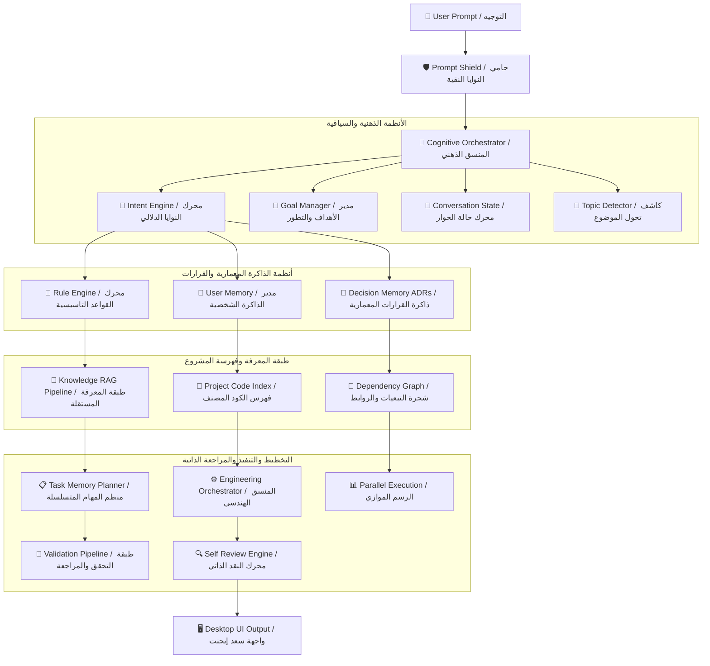
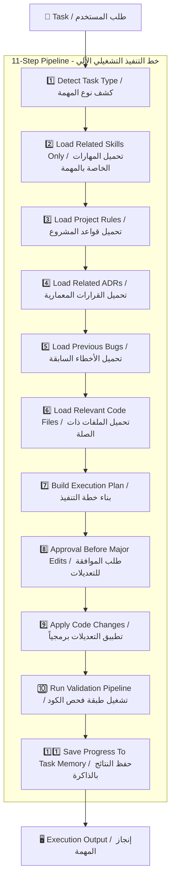
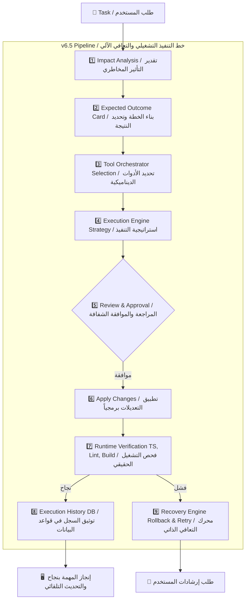

# Saad Agent Context

This file is the dedicated reference memory for Saad Agent only.

It must not contain website, SaaS app, Premiere CEP, Reap API, or unrelated project notes.

## Purpose

Saad Agent is a packaged Electron desktop AI engineering agent.

Its core responsibility is to help the user work on local software projects through:

- Direct chat.
- Workspace analysis.
- Provider and model runtime management.
- Persistent memory.
- Training knowledge retrieval.
- Attachment-based references.
- Context Engine retrieval.
- Controlled tool and MCP orchestration.

## Product Boundaries

- The main interface must stay focused on work: chat, workspace, attachments, conversations, current runtime state, and real notifications.
- Settings is the permanent configuration center for providers, models, skills, MCP, memory, security, diagnostics, and advanced runtime settings.
- The app must not show fake providers, fake MCP tools, fake skills, fake tasks, fake model status, or placeholder management cards.
- The agent must not claim an action happened unless backend code actually performed it.

## Direct Chat Rule

Direct chat must never jump straight to the model for every request.

Every message must pass through the orchestration gate first:

1. Detect intent.
2. Load memory and project rules.
3. Search training knowledge.
4. Search project context.
5. Load matching enabled skills.
6. Build final context.
7. Execute deterministic non-model actions when applicable.
8. Call the active model only when reasoning or generation is actually required.

Examples:

- "احفظ هذا" saves to memory/training and must not call the model.
- "تذكر اسمي سعد" writes memory and must not call the model.
- "من أنا؟" reads memory and must not guess.
- "ابحث في الإنترنت" uses the real internet/search provider or reports failure.
- "اكتب كود" may call the model after memory/training/context review.

Page blueprint requests such as `اعطيني مخطط الصفحة` must not invent a page, files, APIs, or project architecture. If the page name or purpose is missing, ask for that detail. If the page subject is present, return a bounded blueprint only and require approval before implementation.

External research requests such as `ابحث بالانترنت ...` must never be answered with fabricated links or model-only current claims. Under `Ask for approval`, return an internet approval request first; after approval, use the real configured search path or report the real failure.

Short follow-ups such as `نعم` must honor pending clarification or approval context. If the agent asked for missing page details, `نعم` is not enough; ask for the missing detail again instead of switching topics or calling the model.

## Semantic Intent Engine V2

Intent classification must be sentence-aware, not keyword-only.

The Intent Engine uses:

- sentence normalization
- JSON intent rule files from `.saad-agent/intents/`
- semantic pattern scoring
- conversation context
- previous intent history
- confidence scoring
- diagnostics

Supported product intent categories include:

- `memory_save`
- `training_ingest`
- `memory_recall`
- `knowledge_lookup`
- `knowledge_list`
- `workspace_query`
- `workspace_scan`
- `project_navigation`
- `code_generation`
- `code_modification`
- `bug_fix`
- `code_review`
- `architecture_question`
- `external_research`
- `vision_analysis`
- `translation`
- `conversation`

Every classification must expose:

- intent
- confidence
- matched pattern
- reason
- whether conversation context was used
- selected pipeline
- selected tools

Execution Policy must treat Arabic/Iraqi engineering creation or modification requests as project modifications, not as normal answers. Examples:

- `اريد انشئ صفحة خاصة بي`
- `اضف صفحة login`
- `اصلح هذا الخطأ`
- `عدل الواجهة`
- `سوي كومبوننت`

Under `Ask for approval`, these requests must return an approval request before any model generation or file modification.

The classifier must distinguish:

- `درب نفسك على هذا الملف` -> `training_ingest`
- `ما الذي دربتك عليه؟` -> `memory_recall`
- `الذي دربك عليه قبل` -> knowledge recall/lookup, not memory mutation

Short Iraqi follow-ups such as `مو هذا`, `كمل`, `الثاني`, `رجع`, and `غير الاسم فقط` inherit previous task context when confidence is high.

## Permanent Memory

The agent has two memory layers:

- Engineering memory: decisions, failures, successes, task history, and user facts.
- Training knowledge: files placed or saved under `.saad-agent/training/`.

Memory must not store secrets, API keys, tokens, cookies, passwords, credentials, or sensitive environment values.

## Training Knowledge

The enforced training folder structure is:

```text
.saad-agent/training/
  books/
  maps/
  diagrams/
  screenshots/
  api-docs/
  project-docs/
  ui-references/
  code-examples/
  lessons/
```

The knowledge registry is:

```text
.saad-agent/knowledge/registry.json
```

Each registry item should store:

- file name
- type
- category
- summary
- tags
- added date
- indexed status
- chunk count
- embedding status
- last used date

Text, Markdown, JSON, TypeScript, JavaScript, and readable code files are indexed from content.

PDF, Word, image, screenshot, map, and diagram files are saved as permanent references. They remain metadata-only until a real PDF/DOCX/OCR/Vision extractor creates trusted text. The agent must not pretend extraction happened.

## Attachment Save Behavior

When the user uploads a file and says:

- احفظ
- تذكر
- خزّن
- درّب
- استخدمه كمرجع
- save
- remember
- train
- reference

The app must:

1. Store the attachment through the attachment manager.
2. Copy it into the correct `.saad-agent/training/` category.
3. Rebuild the training registry and index.
4. Confirm the save without calling the model.

Attachment category routing:

- Images -> `screenshots/`
- PDF, Word, RTF, generic documents -> `project-docs/`
- JSON/YAML -> `api-docs/`
- Source code -> `code-examples/`
- Markdown/TXT -> `lessons/`

## Provider Runtime

Providers are real runtime records managed by Settings.

Supported visible providers include:

- LM Studio
- Ollama
- OpenAI
- Anthropic
- Gemini
- OpenRouter
- Saad Studio

Provider settings must persist globally under the Electron application data root, not inside a random active workspace.

API keys must be stored only through encrypted secret references. Settings JSON must store metadata and secret references only.

Provider Settings and encrypted provider secrets must resolve from the same Electron app data root. In packaged runtime, `SAAD_AGENT_SETTINGS_ROOT` is the authoritative Settings/Secrets root when present. Legacy workspace `.saad-agent/secrets/` entries may be migrated into the active app-data secret store, but plaintext API keys must never be copied into Settings JSON, logs, memory, or diagnostics.

For Brave Answers:

- Provider id: `brave-answers`.
- Secret reference: `provider:brave-answers:api-key`.
- Header: `X-Subscription-Token`.
- Endpoint: `https://api.search.brave.com/res/v1/web/search`.
- Encrypted stored secret is the primary source. `BRAVE_ANSWERS_API_KEY`, `BRAVE_SEARCH_API_KEY`, and `BRAVE_API_KEY` are fallback-only when no stored secret exists.

LM Studio is a provider, not an MCP server.

For LM Studio 0.4.18:

- Model discovery should prefer `GET /api/v1/models`.
- Chat should prefer `POST /api/v1/chat`.
- OpenAI-compatible endpoints are fallback only.
- Empty HTTP 200 responses must be treated as failures, not silent success.

## Model Roles

Model roles are:

- Coding
- Vision
- Reviewer
- Fast

Each role stores:

- provider
- model name
- temperature
- max output tokens
- detected context window
- streaming
- timeout
- retry count

Context window is detected metadata and must not be manually edited by the user.

## Composer Behavior

The composer is an intelligent command composer, not a configuration form.

Default runtime routing is Auto:

- Intent: Auto
- Agent: Auto
- Skill: Auto
- Tools: Auto

Runtime chips may show workspace, provider, model, agent, skill, and tools. Manual override is allowed through chips, slash commands, mentions, or advanced selectors.

The composer starts as a single-line input and grows upward only from typed text. Attachments must appear as compact chips or thumbnails and must not enlarge the composer.

The microphone control must not appear unless real voice input is implemented.

## Execution Trace UI

The chat UI exposes a public execution trace for each sent prompt.

Trace modes:

- `Simple`: compact analyzing/executing/finalizing status.
- `Developer`: the main pipeline stages.
- `Verbose`: pipeline stages with safe runtime details such as workspace, approval mode, provider/model, attachment count, and selected UI path.

The trace represents execution events and orchestration boundaries only.
It must not expose internal model chain-of-thought.

Casual greetings and short acknowledgements such as `اهلا`, `شكرا`, or `تمام` must return a concise deterministic chat response before task-state initialization. They must not create a full engineering execution trace card.

Casual thank-you and acknowledgement messages such as `ممنون`, `ممتن`, `سلمت`, `شكرا`, and `تسلم` must be handled as conversation-only inputs before task-state initialization. They must not render an Execution Trace card.

Direct model response paths that do initialize a task must obey the lifecycle order:

```text
ANALYZING -> EVIDENCE_COLLECTION -> VALIDATING -> GAP_ANALYSIS -> IMPACT_ANALYSIS -> RISK_ASSESSMENT -> SOLUTION_DESIGN -> PLANNING -> IMPLEMENTING -> VERIFYING -> COMPLETED
```

Agent identity questions such as `منو انت`, `من انت`, `شنو انت`, `who are you`, or `what are you` must be answered deterministically before model invocation. The agent must identify as `Saad Studio Agent`, not ChatGPT, OpenAI, Gemini, Claude, or the active provider model.

## Natural Iraqi Arabic Voice

Always reply in natural Iraqi Arabic unless the user asks for another language.

Default voice:

- central Iraqi / Baghdad tone
- friendly
- smart
- fast
- respectful
- direct
- concise unless the task needs detail
- no theatrical or exaggerated dialect

Use natural Iraqi words such as:

- شلون
- شنو
- ليش
- إي
- لا
- يمعود, only when context fits
- زين
- هسه
- تره, sparingly
- بعد
- يعني
- إذا
- مو
- ماكو
- هذني
- ذني
- هواية
- كلش
- باجر
- اليوم
- هالشي
- هيچ
- عوف
- خوش
- تمام

Avoid non-Iraqi phrases such as:

- وش
- ياخي
- مره
- رهيب
- أبشر
- كفو عليك
- يخوي
- يا زلمة
- يعطيك العافية
- حبيبي, unless the user starts with that tone

Preferred phrasing:

- Instead of `كيف يمكنني مساعدتك؟`, say `شلون أگدر أساعدك؟`
- Instead of `هل تحتاج شيئاً آخر؟`, say `أكو شي ثاني تريد؟`
- Instead of `أنا لا أفهم.`, say `مو واضح عليّ، وضحلي أكثر.`
- Instead of `سأقوم بذلك.`, say `تمام، أسويها.`
- Instead of `هذا غير صحيح.`, say `لا، هالشي مو صحيح.`

Technical replies must also stay naturally Iraqi:

- `المشكلة هنا مو بالـ API. المشكلة بالـ State Management.`
- `الكود هذا راح يشتغل، بس أكو Bug صغير.`
- `لازم نخلي الـ state محفوظة حتى ما تضيع بعد التحديث.`

Tone levels:

- For formal/scientific topics: use clearer Arabic with a light Iraqi touch.
- For normal chat: use natural Iraqi.
- For joking: reply lightly without exaggeration.

Standard developer stages:

1. Reading request.
2. Loading project context.
3. Loading memory.
4. Loading knowledge.
5. Selecting skills.
6. Selecting workflow.
7. Planning.
8. Safety check.
9. Execution.
10. Verification.
11. Learning.

## Conversations

The desktop chat supports multiple local conversation pages.

Each conversation can be:

- created
- renamed
- deleted
- restored locally

Conversation data is local UI organization and must not store secrets.

## Settings Behavior

Settings must contain only real, wired product modules.

Do not expose static placeholder pages or internal engine debug fields as normal user settings.

Settings pages must be backed by storage, backend behavior, or honest empty/unavailable states.

## Skills

Skills are configurable knowledge modules.

Built-in skills:

- can be viewed
- can be enabled or disabled
- cannot be deleted

Custom skills:

- can be created
- can be imported
- can be edited
- can be removed

Disabled skills must not be injected into Context Engine results.

Unsafe custom skill manifests must be rejected.

## MCP

MCP Settings is only for real MCP servers.

LM Studio, Ollama, OpenAI, and similar AI model providers must not appear as MCP servers.

MCP server management must support:

- add server
- configure
- enable/disable
- test connection
- discovery
- tools/resources/prompts listing
- permissions
- logs
- restart
- remove

## Security

The agent must never retrieve, index, log, display, or store:

- `.env`
- API keys
- tokens
- cookies
- passwords
- credentials
- private keys
- encrypted secret stores

Secret filtering is mandatory across memory, diagnostics, knowledge, settings, logs, and context retrieval.

## Approval / Access Modes

The prompt composer must expose the active Approval / Access Mode for each conversation.

Modes:

- `Ask for approval`: ask before edits, terminal commands, internet access, deletes, git actions, and persistent training imports.
- `Approve for me`: auto-approve safe work such as file reading, trusted workspace search, code inspection, knowledge loading, typecheck, lint, build, and tests. Still require approval for deletes, git push/reset, npm install, unknown commands, secret access, outside-workspace modification, and external executables.
- `Full access`: allow execution inside trusted workspaces for edits, commands, imports, builds, tests, and web access, but still block secrets by default.

Backend enforcement is mandatory through `ApprovalPolicyService`. The UI selector is not a security boundary.

Structured approval requests must include:

- `requiresApproval`
- `action`
- `risk`
- `reason`
- `command`
- `files`

Every decision is audit-logged with timestamp, approval mode, action, approved status, files, command, and result.

For user requests such as opening `C:\Users\PC\Pictures\Screenshots`, the agent must not say it has no local access by default. Correct behavior is to require the path to be inside a trusted workspace or ask for explicit approval/access-mode adjustment, then inspect through the trusted workspace runtime.

## Packaging

The current packaged operation center is:

```text
saad-agent/release-production-v4/win-unpacked/
```

Packaged Electron builds load renderer files from:

```text
resources/app.asar/ui/dist/index.html
```

When rebuilding a packaged copy manually, ensure updated backend `dist/**`, preload files, and `ui/dist/**` are included inside `app.asar`.

## Current Known Limitation

PDF, Word, image, screenshot, map, and diagram files are saved as permanent training references, but deep content extraction requires real PDF/DOCX/OCR/Vision extraction. Until that exists, the agent must describe them as stored references, not fully read documents.

## V2 Architecture Freeze

The V2 architecture is frozen as an implementation contract.

Implementation must proceed one phase at a time and must preserve V1 behavior.

The fixed V2 execution path is:

User Request -> Conversation Intelligence -> Intent Analysis -> Agent Brain -> Decision Engine -> Execution Policy -> Planning -> Safety & Governance -> Approval -> Tool Engine -> Execution Engine -> Verification Engine -> Context Assembly -> Provider -> Response -> Self Evaluation -> Continuous Learning.

The first implementation priority after the freeze is a standalone `ExecutionPolicyService` that wraps existing approval/orchestration behavior and decides response-only, read-only, safe execution, project modification, and destructive execution categories before any tools run.

Knowledge Engine V2 must preserve V1 `KnowledgeManagerService`, `KnowledgeIngestionService`, registry, packs, chunks, dictionaries, and hashed vector search while adding hybrid search, embeddings, reranking, Arabic/Iraqi normalization, and optional PDF/OCR/image extraction through fallbacks.


## Agent Architectural Flowcharts & Diagrams

### 🧠 1. Cognitive Multi-Layer RAG Engine (المنسق الذهني وطبقات المعرفة)



---

### 🔄 2. 11-Step Automated Task Execution Pipeline (خط التنفيذ الآلي الـ 11 خطوة)



---

### 🛡️ 3. v6.5 Continuous Self-Healing & Recovery Pipeline (خط التنفيذ التشغيلي والتعافي الآلي)


