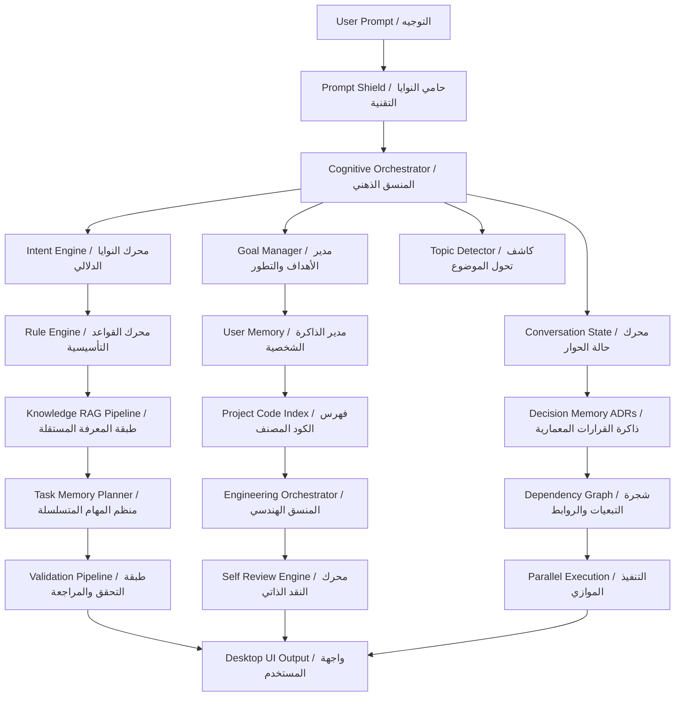
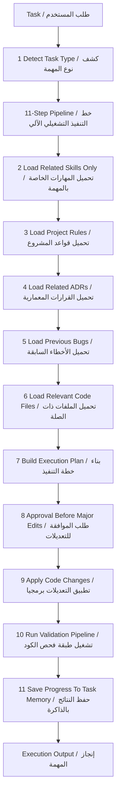
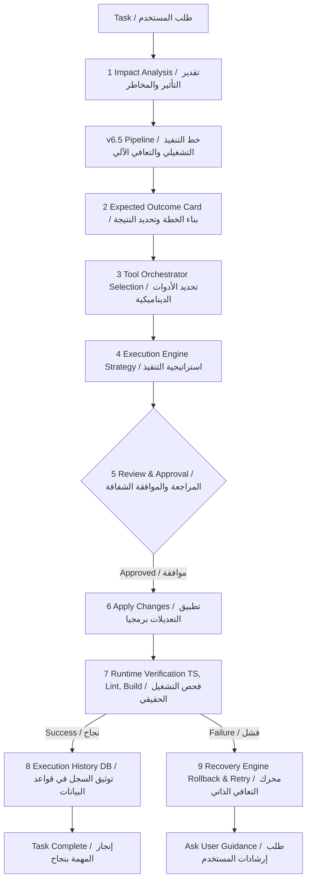

# Saad Studio Agent v6.5 Architecture Reference

This reference records the implemented v6.5 desktop-agent architecture. It is documentation for real services in `src/`; it is not a promise of model fine-tuning. Current knowledge learning means persistent retrieval/indexing, engineering memory, and vision-summary storage.

## Cognitive And Multi-Layer RAG Engine

## 11-Step Automated Workflow

## Continuous Self-Healing Pipeline

## Implemented Service Inventory

- `intent-engine.ts`: multilingual routing for memory, workspace, web, code, debug, image, and generation intents.
- `cognitive-orchestrator.ts`: top-level cognitive routing, diagnostic reports, tool selection, and state integration.
- `tool-orchestrator.ts`: tool selection across filesystem, git, terminal, browser, Brave, MCP, and Docker categories.
- `operational-skill-pipeline.ts`: 11-step task execution workflow.
- `execution-engine.ts`: execution strategies and parallel execution coordination.
- `validation-pipeline.ts`: real TypeScript/build/lint validation commands.
- `recovery-engine.ts`: checkpoint/stash-based recovery fallback.
- `execution-history.ts`: persistent execution log at `.saad-agent/history/execution-db.json`.
- `brave-answers.ts`: live Brave Answers integration when configured with a secret-managed API key.
- `workspace-watcher.ts`: chokidar workspace watcher with 500ms debounce.
- `settings-manager.ts`: persistent providers, models, MCP, skills, and runtime configuration.
- `secrets-manager.ts`: encrypted secret references; secrets are not stored in Settings JSON.
- `knowledge-ingestion.ts`: local chunking plus deterministic vector index stored in `.saad-agent/knowledge/vector-index.json`.

## Current Production Boundaries

- The system does not fine-tune models.
- Local semantic retrieval is implemented through deterministic embeddings and JSON persistence, not an external vector database.
- PDF and connector ingestion remain future sources unless a concrete parser/connector is wired.
- Secret-like files and values are excluded from retrieval and index storage.
