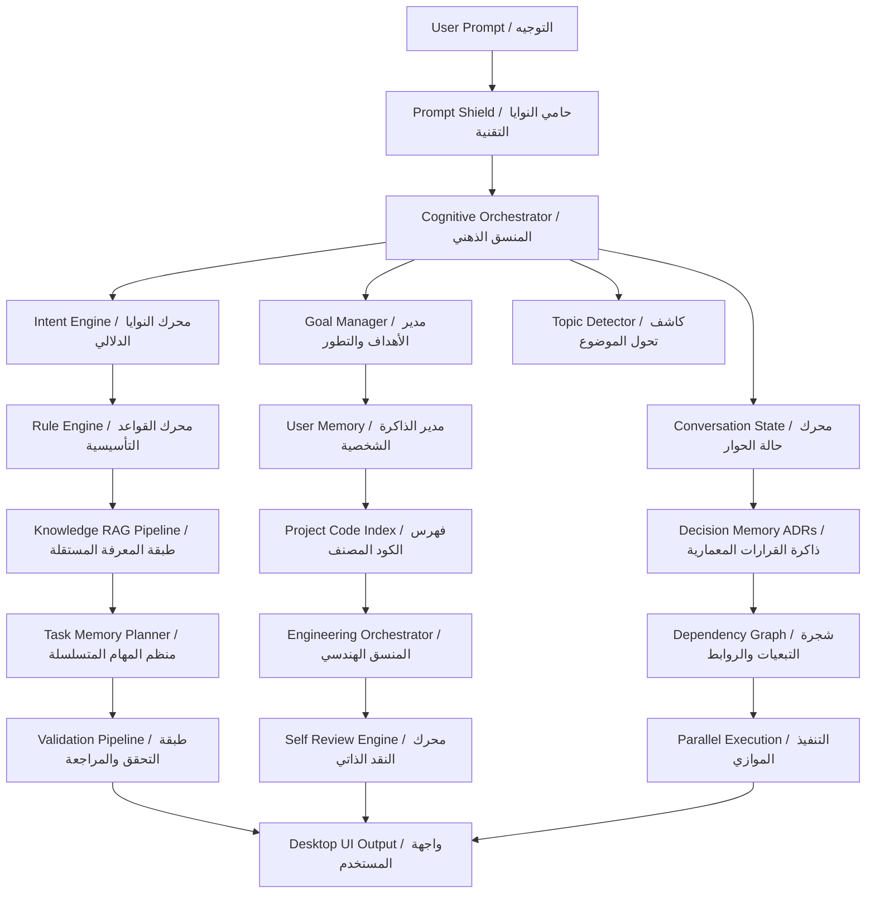
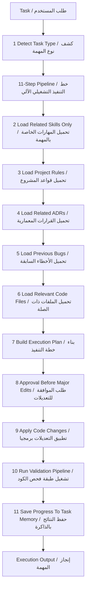
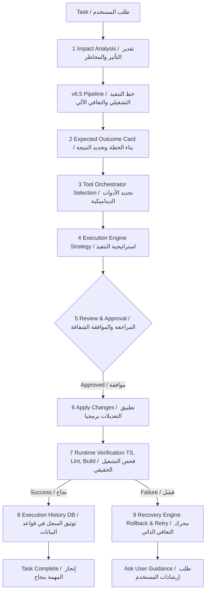
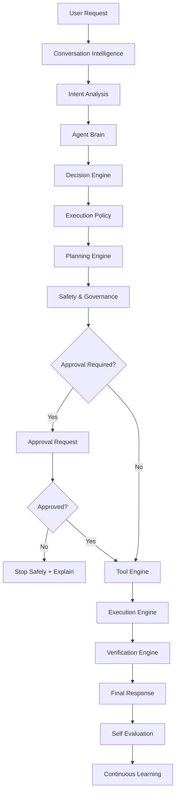
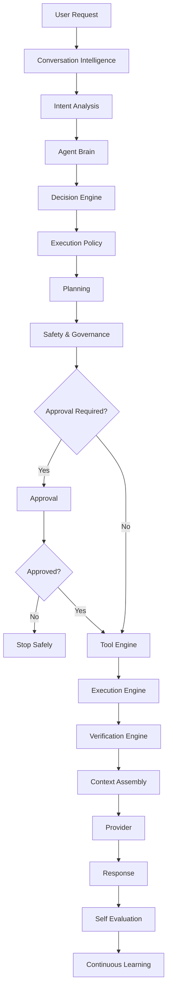

# Saad Studio Agent v6.5 Architecture Reference

This reference records the implemented v6.5 desktop-agent architecture. It is documentation for real services in `src/`; it is not a promise of model fine-tuning. Current knowledge learning means persistent retrieval/indexing, engineering memory, and vision-summary storage.

## Cognitive And Multi-Layer RAG Engine



## 11-Step Automated Workflow



## Continuous Self-Healing Pipeline



## Execution Decision Pipeline Review

This is a design review of the current execution decision path. The current system already has important safety pieces, especially `ApprovalPolicyService`, `ChatOrchestratorService`, `OperationalSkillPipelineService`, `ExecutionEngineService`, `ValidationPipelineService`, `RecoveryEngine`, `TrustedWorkspaceRuntime`, and the knowledge/pre-answer review gate. However, the architecture does not yet expose one standalone `ExecutionPolicyService` that owns the full decision of whether a user request may execute.

### Current Finding

- `ApprovalPolicyService` exists and is real. It decides approval requirements for concrete actions such as file reads/writes, deletes, workspace search, terminal commands, git, internet use, knowledge import, local path opening, and package installation.
- `ApprovalPolicyService` supports approval modes that map closely to execution modes:
  - `ask` behaves like strict Assisted Mode.
  - `approve_for_me` behaves like Autonomous Mode for safe actions, with approval for high-risk actions.
  - `full_access` allows broad trusted-workspace execution while still blocking secrets.
- `ChatOrchestratorService` performs intent detection, pre-answer review, deterministic non-model actions, internet gating, attachment-training import gating, and model invocation.
- `OperationalSkillPipelineService` plans operational work, selects tools, chooses an execution strategy, builds an execution plan, and records task/execution history.
- `ExecutionEngineService` currently chooses execution strategy only (`Sequential`, `Parallel`, `Batch`, `Retry`, `Rollback`). It does not decide whether execution is allowed.
- Conclusion: the current system has an approval policy layer, but it does not yet have a complete deterministic execution policy layer. Execution permission is distributed across orchestrator branches, IPC handlers, approval checks, and tool/runtime services.

### Required Target Pipeline

All executable requests should pass through this deterministic pipeline before any tool execution:



### Execution Policy Responsibilities

The recommended standalone `ExecutionPolicyService` should be the single authority for execution allow/deny decisions. It should return a structured decision before planning or tools run.

It must determine:

- Whether the request is response-only or executable.
- Whether knowledge retrieval is required.
- Whether memory retrieval is required.
- Whether project context retrieval is required.
- Whether tools are required.
- Whether planning is required.
- Whether approval is required.
- Whether execution is allowed.
- Whether the task is read-only, write-capable, or destructive.
- Whether rollback/checkpointing is required.
- Whether post-execution verification is mandatory.
- Which execution mode applies.
- Which tools are allowed for the request.
- Which verification evidence must be collected.

### Execution Categories

The policy should classify every request into one of these categories:

| Category | Name | Examples | Action |
| --- | --- | --- | --- |
| A | Response Only | explanation, translation, discussion, architecture review, non-mutating code review | No execution. Model response may run after memory/knowledge/context review when useful. |
| B | Read Only | inspect files, search workspace, search knowledge, analyze logs, analyze architecture | Allow only read/search tools inside trusted workspaces and approved knowledge sources. |
| C | Safe Engineering | build, test, lint, format, diagnostics, documentation generation | Allow according to execution mode. Verification output is required. |
| D | Project Modification | fix bug, create page, modify code, connect provider, update workflow, update prompt box | Planning is required. Approval depends on mode and risk. Checkpoint/backup is required before writes. Verification is mandatory after writes. |
| E | Destructive Operations | delete files, reset project, database migration, remove knowledge, overwrite project, git push, release deployment | Always require explicit approval. Must include risk, affected files/resources, rollback plan if available, and confirmation evidence. |

### Execution Modes

The architecture should use product-level execution modes and map them to the current approval behavior:

| Product Mode | Current Equivalent | Behavior |
| --- | --- | --- |
| Advisor Mode | New policy mode needed | Never execute tools. Analysis, planning, and recommendations only. |
| Assisted Mode | `ask` | Execute only after approval for writes, terminal, internet, git, persistent imports, and destructive actions. |
| Autonomous Mode | `approve_for_me` | Execute safe read/build/test/lint/search actions automatically. Ask for destructive or high-risk actions. |

`full_access` may remain as an advanced access mode, but Execution Policy should still classify category and risk. Full access must not bypass `.env`, tokens, cookies, credentials, private keys, or encrypted secret storage.

### Proposed Execution Policy Decision Shape

The policy should return a deterministic object before planning:

```ts
type ExecutionCategory = "response_only" | "read_only" | "safe_engineering" | "project_modification" | "destructive";
type ExecutionMode = "advisor" | "assisted" | "autonomous" | "full_access";

interface ExecutionPolicyDecision {
  category: ExecutionCategory;
  mode: ExecutionMode;
  executable: boolean;
  allowed: boolean;
  requiresKnowledge: boolean;
  requiresMemory: boolean;
  requiresProjectContext: boolean;
  requiresTools: boolean;
  requiresPlanning: boolean;
  requiresApproval: boolean;
  requiresCheckpoint: boolean;
  requiresRollbackPlan: boolean;
  requiresVerification: boolean;
  allowedTools: string[];
  blockedTools: string[];
  risk: "safe" | "medium" | "high";
  reason: string;
  approvalRequest?: {
    action: string;
    risk: "safe" | "medium" | "high";
    reason: string;
    command?: string;
    files: string[];
  };
  verificationPlan: string[];
}
```

### Relationship To Existing Services

`ExecutionPolicyService` should not replace the existing services. It should sit above them:

- `Conversation Intelligence`: normalizes follow-ups, corrections, topic shifts, and Iraqi dialect references.
- `IntentEngine`: identifies the user intent and confidence.
- `Agent Brain` / `Decision Engine`: converts intent plus context into candidate task type and required capability.
- `ExecutionPolicyService`: decides category, mode, permission, required planning, required approval, allowed tools, checkpoint/rollback requirements, and verification obligations.
- `ApprovalPolicyService`: remains the low-level action approval/audit service. Execution Policy calls it rather than duplicating approval logic.
- `OperationalSkillPipelineService` / `Planner`: runs only when policy says planning is required.
- `ToolOrchestratorService`: receives only policy-approved tool categories.
- `ExecutionEngineService`: chooses execution strategy after policy approval, not before.
- `ValidationPipelineService`: runs the policy-required verification plan.
- `RecoveryEngine`: activates only when policy requires rollback support or execution fails.
- `ExecutionHistoryService` and Engineering Memory: record decisions, failures, verification evidence, and lessons.

### Missing Capabilities In The Current Architecture

- No standalone `ExecutionPolicyService` currently owns the entire allow/deny decision.
- No first-class Category A-E classification exists before execution.
- No explicit Advisor Mode exists. The closest behavior is response-only branching in `ChatOrchestratorService`, but it is not a configurable execution mode.
- Planning requirements are implicit in operational pipelines rather than policy-owned.
- Rollback/checkpoint requirements are not centrally derived from risk/category.
- Verification requirements are available through validation services, but not centrally mandated per category.
- Tool allowlists are enforced in several places, not as a single decision artifact passed to the Tool Engine.
- Failure policy exists in parts (`RecoveryEngine`, validation, history), but "stop safely, capture diagnostics, preserve state, propose recovery" should be encoded in Execution Policy outputs.

### Recommended Refinements

1. Add `ExecutionPolicyService` as a standalone subsystem.
2. Keep `ApprovalPolicyService` as the enforcement/audit layer for concrete actions.
3. Add product execution modes: Advisor, Assisted, Autonomous. Map them to existing approval behavior without breaking current `approvalMode`.
4. Classify every request into Category A-E immediately after Agent Brain / Decision Engine.
5. Require a policy decision before `PlanningEngine`, `ToolOrchestratorService`, `ExecutionEngineService`, internet use, workspace writes, git, package installation, or knowledge mutation.
6. Generate an explicit `verificationPlan` for Categories C, D, and E.
7. Require checkpoint/rollback planning for Category D and E.
8. Add diagnostics that show category, mode, allowed, approval required, planning required, tools allowed, verification required, and reason.
9. Record the final policy decision into execution history after the task completes or fails.
10. Treat failure as a policy-governed stop condition: no blind retries, no escalation of tool permissions, and no continuation after failed verification without a recovery decision.

### Failure Policy

If execution fails, the agent must:

- Stop the current action chain safely.
- Capture diagnostics and command/tool output.
- Preserve task state and affected-file list.
- Report exact failure evidence.
- Propose recovery or rollback.
- Request approval before any retry that writes files, runs new commands, installs packages, deletes files, migrates data, or pushes git changes.

It must not:

- Continue blindly after a failed build/test/lint.
- Change strategy from read-only to write operations without a new policy decision.
- Retry destructive operations automatically.
- Hide provider/tool/runtime errors.

## Implemented Service Inventory

- `intent-engine.ts`: multilingual routing for memory, workspace, web, code, debug, image, and generation intents.
- `cognitive-orchestrator.ts`: top-level cognitive routing, diagnostic reports, tool selection, and state integration.
- `tool-orchestrator.ts`: tool selection across filesystem, git, terminal, browser, Brave, MCP, and Docker categories.
- `operational-skill-pipeline.ts`: 11-step task execution workflow.
- `execution-engine.ts`: execution strategies and parallel execution coordination.
- `validation-pipeline.ts`: real TypeScript/build/lint validation commands.
- `recovery-engine.ts`: checkpoint/stash-based recovery fallback.
- `execution-history.ts`: persistent execution log at `.saad-agent/history/execution-db.json`.
- `brave-answers.ts`: live Brave Answers integration when configured with a secret-managed API key.
- `workspace-watcher.ts`: chokidar workspace watcher with 500ms debounce.
- `settings-manager.ts`: persistent providers, models, MCP, skills, and runtime configuration.
- `secrets-manager.ts`: encrypted secret references; secrets are not stored in Settings JSON.
- `knowledge-ingestion.ts`: local chunking plus deterministic vector index stored in `.saad-agent/knowledge/vector-index.json`.
- `approval-policy.ts`: existing low-level approval, risk, mode, and audit service. It is not a full execution policy layer yet.
- Proposed future subsystem: `execution-policy.ts`, a standalone deterministic execution decision authority that classifies requests into execution categories and decides whether planning, approval, tools, checkpoints, rollback, and verification are required.

## Current Production Boundaries

- The system does not fine-tune models.
- Local semantic retrieval is implemented through deterministic embeddings and JSON persistence, not an external vector database.
- PDF and connector ingestion remain future sources unless a concrete parser/connector is wired.
- Secret-like files and values are excluded from retrieval and index storage.
- Current execution safety is real but distributed across orchestrators, IPC handlers, approval checks, and tool services. The architecture should converge on a dedicated Execution Policy layer before additional autonomous execution expansion.

## Saad Agent V2 Final Architecture Freeze

This section freezes the approved Saad Agent V2 architecture before further implementation. V2 is an extension layer over the current working V1/v6.5 runtime. It must wrap, compose, or progressively upgrade existing services rather than replacing stable V1 behavior.

### Freeze Principles

- V1 remains operational during every V2 phase.
- No subsystem may claim project state without real evidence from files, registry data, tool output, provider responses, or verified runtime state.
- The agent thinks before acting, plans before executing, verifies before answering, and learns only through safe storage decisions.
- All execution decisions must pass through a deterministic decision path before tools run.
- Every new V2 subsystem must have clear ownership, stable inputs, stable outputs, tests, and backward-compatible fallbacks.
- Features must be implemented incrementally. After each phase: build, test, verify, update memory, report, and stop for approval.

### Frozen V2 Subsystem Map

| Subsystem | Ownership | Current Status | V2 Contract |
| --- | --- | --- | --- |
| Agent Brain | Top-level reasoning coordinator | Partially represented by cognitive/chat orchestration | Owns high-level task interpretation and delegates to Decision Engine. Does not execute tools directly. |
| Conversation Intelligence | Natural conversation and follow-up resolver | Partially present through domain/intent/conversation logic | Resolves Arabic/Iraqi follow-ups, corrections, topic switches, references, and teaching mode before Intent Analysis. |
| Intent Analysis | Intent classification | Implemented through `intent-engine.ts` | Sentence-aware classification with confidence, matched pattern, context use, reason, selected pipeline, and selected tools. |
| Decision Engine | Converts intent into task decision | Distributed today | Produces candidate task type, capability needs, and execution category input for Execution Policy. |
| Execution Policy | Execution allow/deny authority | Missing as standalone subsystem | Single authority for response-only/read-only/safe/project-modifying/destructive category, planning needs, approval needs, checkpoint/rollback needs, and verification obligations. |
| Task State Engine | Tracks active task lifecycle | Partially represented by task memory/history | Tracks task state, current step, pending approvals, paused/failed/recovery states, and resumability. |
| Capability Registry | Lists available capabilities | Distributed across tools, skills, MCP, providers | Unified registry for tools, skills, MCP servers, providers, extractors, workflows, and engines with availability/permission metadata. |
| Event Bus | Runtime event propagation | Implemented as `event-bus.ts` | Emits structured lifecycle events for planning, approval, tool calls, execution, verification, learning, and failures. |
| Planning Engine | Builds execution plans | Existing planner/pipeline services | Runs only when Execution Policy requires planning. Produces evidence-backed plan and expected verification. |
| Workflow Engine | Reusable workflows | Existing `workflow-engine.ts` and planning workflow | Hosts reusable workflows for page creation, bug fix, provider/model integration, pricing, release, knowledge import, daily maintenance, security review, prompt box updates, and architecture review. |
| Skill Engine | Domain skill loading | Existing skills/registry services | Injects only enabled matching skills. Built-in skills are viewable/toggleable, custom skills are validated before use. |
| Memory Engine | User/project/engineering memory | Existing engineering/user/task memory | Decides whether to ignore, store session memory, project memory, engineering memory, success/failure memory, workflow memory, user memory, or temporary instruction. Never stores secrets. |
| Knowledge Engine V2 | Hybrid retrieval and ingestion | V1 KnowledgeManager/Ingestion exists | Preserves V1 registry/packs/chunks/dictionaries/hashed vector search. Adds embeddings, hybrid search, reranking, normalization, PDF/OCR/image extraction as fallbacks over V1. |
| Context Assembly Engine | Builds final model/tool context | Existing pre-answer/context engines | Assembles memory, knowledge, project, skills, decisions, attachments, and verification constraints under token budget. |
| Tool Engine | Tool selection and dispatch | Existing tool orchestrator/trusted runtime/MCP | Executes only policy-approved tools. Never escalates category without a new policy decision. |
| Execution Engine | Applies approved execution strategy | Existing `execution-engine.ts` is strategy-only | Executes approved plans with checkpoints, rollback hooks, command/file operation evidence, and failure stop rules. |
| Verification Engine | Evidence collection | Existing validation pipeline | Verifies files, diffs, builds, tests, lint, provider responses, knowledge retrieval, RAG retrieval, and workspace state before completion claims. |
| Provider Engine | Model/provider runtime | Existing settings/model client/provider handling | Uses persisted provider/model roles. Never invents provider status or silently accepts empty provider responses. |
| Learning Engine | Continuous improvement | Partially represented by memory/knowledge/history | Learns from conversations, corrections, decisions, success/failure, workflows, imported docs, and user teaching with storage classification and secret filtering. |
| Pricing & Credit Engine | Cost and credit reasoning | Website pricing logic exists; agent-side engine needed | Stores formulas and calculation methods. Never invents provider prices. Uses explicit configured/current sources only. |
| Safety & Governance | Security, approvals, secrets | Existing approval policy and trusted workspace runtime | Centralizes secret blocking, workspace trust, approval mode, destructive-operation gating, and audit logging. |
| Architecture Visualization Engine | Evidence-backed diagrams | Design approved, not implemented | Generates Mermaid and graph diagrams from real source evidence, validates syntax, marks inferred edges, explains in Arabic, and stores diagrams only after approval. |

### Frozen Execution Flow

The V2 execution pipeline is fixed as:



Rules:

- The agent must never execute immediately after understanding a request.
- Response-only and read-only requests still pass through policy; policy may decide no planning/tool execution is required.
- Destructive operations always require explicit approval.
- Failed verification stops the task and triggers failure policy, not blind continuation.

### Knowledge Engine V2 Contract

Knowledge Engine V2 must preserve:

- `KnowledgeManagerService`
- `KnowledgeIngestionService`
- registry
- packs
- chunks
- dictionaries
- current hashed vector search

Knowledge Engine V2 may add:

- provider-agnostic `EmbeddingService`
- real embedding search
- hybrid retrieval
- reranking
- Arabic normalization
- Iraqi dialect normalization
- improved PDF extraction
- OCR and image knowledge extraction
- extraction confidence metadata

Fallback order is fixed:

1. Real embeddings when configured and available.
2. Hashed vector search.
3. Lexical search.

V2 must never remove V1 storage or make existing packs unreadable.

### Continuous Learning Contract

For every interaction, the Learning Engine must decide one of:

- Ignore
- Conversation Memory
- Session Memory
- Project Memory
- Engineering Memory
- Workflow Memory
- Success Memory
- Failure Memory
- Knowledge Vault
- Training Knowledge
- Long-term User Memory
- Playbook
- Temporary Instruction

The agent must not store everything. Sensitive information is never stored permanently. Teaching mode requires recognition of phrases such as "احفظ هذا", "تعلم هذا", "اعتبر هذه قاعدة", "من الآن فصاعدا", "لا تفعل", "دائما استخدم", and "هذه الطريقة الصحيحة". Permanent storage should ask for confirmation unless automatic learning is enabled.

### Architecture Visualization Engine Contract

The visualization subsystem must generate diagrams only from real project evidence:

- Mermaid flowcharts
- sequence diagrams
- state diagrams
- class diagrams
- ER diagrams
- dependency graphs
- service graphs
- workflow graphs
- tool flow
- knowledge flow
- agent decision trees
- provider integration graphs
- runtime architecture graphs

It must validate Mermaid syntax before display, explain diagrams in Arabic, keep node names technical/readable, mark inferred relationships as inferred, and allow exporting. Useful diagrams may be stored as project knowledge only after approval.

### Engineering Workflow Library

The workflow engine should provide reusable workflows for:

- Create Page
- Fix Bug
- Provider Integration
- Model Integration
- Pricing Update
- Credit Calculation
- Release
- Deployment
- Knowledge Import
- RAG Training
- Daily Maintenance
- Security Review
- Prompt Box Updates
- Architecture Review

Each workflow must declare required context, required tools, approval needs, expected files, verification plan, and failure policy.

### Ownership And Coupling Review

- Existing duplication risk: approval and execution categorization are split between `ApprovalPolicyService`, `ChatOrchestratorService`, IPC handlers, and trusted workspace runtime.
- Missing path: standalone Execution Policy is not implemented yet and should be the first execution-governance phase before increasing autonomy.
- Hidden coupling risk: direct chat currently owns too much routing. V2 should move decision/category logic to Decision Engine + Execution Policy while keeping current direct chat as a compatibility entrypoint.
- Circular dependency risk: Knowledge Engine, Learning Engine, and Context Assembly must not call Provider directly during storage/indexing. Provider calls belong behind extraction/embedding interfaces.
- Complexity rule: do not redesign working V1 services. Wrap them behind V2 interfaces and add fallback paths.

### Implementation Phase Order

1. Freeze documentation and contract. No runtime behavior change.
2. Add `ExecutionPolicyService` as a wrapper over existing `ApprovalPolicyService` and orchestrator decisions.
3. Add Task State Engine decision records and policy diagnostics.
4. Add Capability Registry as a read-only registry over existing tools, providers, skills, MCP, extractors, and workflows.
5. Implement Knowledge Engine V2 hybrid search while preserving V1 registry/packs/chunks/dictionaries.
6. Add embedding provider interface and hashed/lexical fallback tests.
7. Add reranking and Arabic/Iraqi normalization.
8. Add PDF/OCR/image extraction as optional extractors with confidence metadata.
9. Add Learning Engine storage-classification layer.
10. Add Architecture Visualization Engine with source evidence and Mermaid validation.
11. Add workflow library phase by phase.
12. Integrate Pricing & Credit Engine only after formula/source ownership is defined.

After every phase: run build, run tests, verify evidence, update `PROJECT_CONTEXT.md`, report changed files, then stop for approval.
